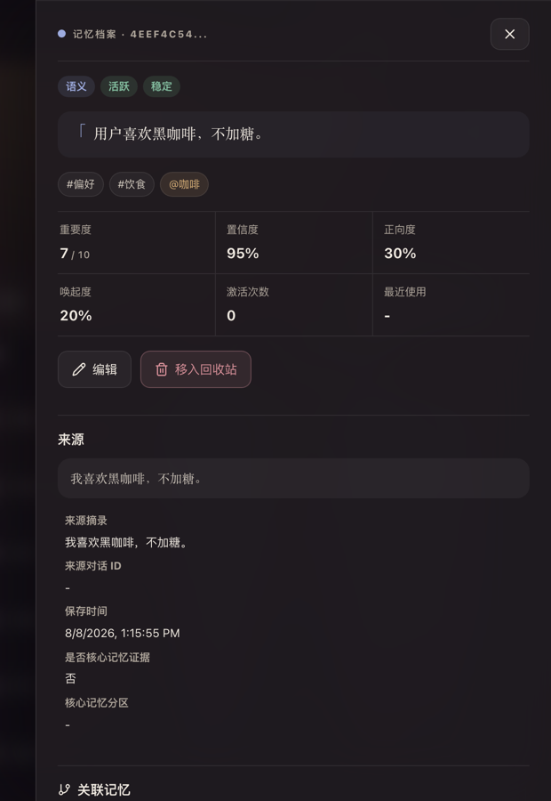
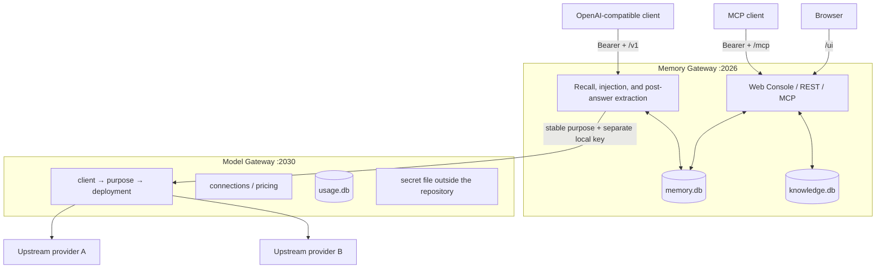

<div align="center">

# 🧠 Memory Platform

**Give your AI memory across conversations.**

Keep memory on your own device, where you can inspect, edit, delete, and back it up.<br>
Works with OpenAI Chat Completions and MCP without locking memory to one model or client.

[](https://github.com/SparkHello/Memory_Platform/releases)
[](https://github.com/SparkHello/Memory_Platform/actions/workflows/ci.yml)
[](LICENSE)

[中文](README.md) · **[English](README.en.md)**

[🚀 Get started](#-quick-start) · [✨ One-minute overview](#-one-minute-overview) · [🔌 Connect your client](#-connecting-clients)

</div>


<p align="center"><sub>Local-first · Auditable · Model-neutral · All product interfaces use demo data and contain no real user content</sub></p>

## ✨ One-minute overview

| What you may want to know first | Short answer |
| --- | --- |
| **What does it do?** | It sits between your chat client and the model, recalls relevant memory when needed, and saves durable information after a complete answer. |
| **Who is it for?** | People already using Chatbox, RikkaHub, FLIT, another OpenAI-compatible client, or MCP who want AI to retain preferences and long-running project context. |
| **What do I need?** | Your own computer, Docker Desktop (recommended), and an API key for a model provider. Source installation requires Python 3.12+, Node.js 22, and npm. |
| **Where is my data?** | Memory, knowledge documents, and runtime configuration remain local. Docker stores them in the local `memory-platform-data` volume. |
| **Am I tied to one model?** | No. Your client always uses `memory-auto`; changing the provider or model is a server-side setting. |
| **What is the fastest path?** | Start Docker → configure a model in the browser → enter the Base URL, API key, and model name in your client. |

Memory Platform is not another chat client and does not bundle a model. An embedding model for semantic search is optional; keyword retrieval works without one.

> [!IMPORTANT]
> **“Local-first” does not mean “never connects to the internet.”** Memory, knowledge documents, and configuration stay on your device by default. If you use a cloud model provider, your current message and the related context permitted for that turn are sent to that provider for inference. The default deployment is intended for a personal machine or trusted home network; do not expose it unauthenticated to the public internet.

## 🧭 Choose your path

| Your situation | How Memory Platform handles it | What you get |
| --- | --- | --- |
| Chat normally in Chatbox, RikkaHub, FLIT, or a similar client | The OpenAI-compatible `/v1` endpoint recalls automatically and extracts memory after a complete answer | Keep your existing chat habits without repeatedly introducing yourself |
| Let a model search memory or documents explicitly | `/mcp` exposes memory and isolated knowledge-base tools | The model searches, saves, or organizes only when needed |
| See exactly what the AI remembers | `/ui` shows sources, status, recall reasons, and version history | Search, edit, archive, restore, or permanently delete memory |
| Change models or providers often | Model Gateway maps stable purposes to the actual model | Your client endpoint and memory data do not need to move |

### One studio for context, memory, and related topics


<p align="center"><sub>Open the browser to see the current context, durable core memory, and why a memory was recalled.</sub></p>

## 🧠 How a conversation becomes long-term memory


The goal is to **remember less, but remember reliably** instead of putting every sentence into a database. The system waits for the complete answer, checks the source quote, subject, negation, and sensitivity, then decides whether to save. Truncated, content-filtered, or unfinished tool-call responses do not create new memory.

## 🖥️ See it and stay in control

Every interface below uses demonstration data and contains no real user content. The product UI has not been generated or redrawn; only the focused detail view is losslessly cropped from the original screenshot. Select any image to view it at full size.

### Search and govern the full memory library


<p align="center"><sub>Find the right memory quickly, then pin, archive, restore, or govern entries in bulk.</sub></p>

### Verify one memory's source and status

<p align="center">
  
</p>

<p align="center"><sub>Trace every conclusion back to its source and see status, confidence, and available management actions.</sub></p>

## 🚀 Quick start

### Easiest path: Docker

This is the recommended first experience. Install Docker Desktop and prepare an API key for a model provider; you do not need Python, Node.js, or a local clone of the repository.

```bash
curl -O https://raw.githubusercontent.com/SparkHello/Memory_Platform/main/deploy/docker-compose.user.yml
docker compose -f docker-compose.user.yml up -d
```

The first launch initializes both services. Run the following command and save the two local keys that are printed only once:

```bash
docker compose -f docker-compose.user.yml logs memory-platform
```

- `GATEWAY_API_KEY` signs in to the Web Console and connects chat clients and MCP.
- The Model Gateway admin key unlocks changes to model providers in the browser.

Neither local key is your provider API key. They can be reset if lost, but their old values are never displayed again.

Next:

1. Open `http://127.0.0.1:2026/ui/` and enter `GATEWAY_API_KEY` in Connection Settings.
2. Open “Models & Routes” and use the admin key to unlock configuration for this session.
3. Choose “New connection,” select a preset, enter the provider API key, and choose a model from the discovered list.
4. Follow [Connecting clients](#-connecting-clients) below for Chatbox, RikkaHub, FLIT, or another client.

All runtime data is stored in the `memory-platform-data` Docker volume. Upgrading the image does not delete memory; see [Data, backup, and migration](#-data-backup-and-migration) for backup instructions.

### Install from source

For macOS or Linux, with Python 3.12+, Node.js 22, and npm:

```bash
git clone https://github.com/SparkHello/Memory_Platform.git
cd Memory_Platform
scripts/setup.sh
```

The setup script prepares the environment, builds the Web Console, starts the stack, generates local keys, and opens a guided model setup. Use `scripts/setup.sh --install-only` to prepare the environment without configuring a model, or add `--skip-ui` if you do not need the Web Console.

### Let an AI assistant install it

An AI or agent can follow [Installing with an AI assistant](docs/ai-install.md) (Chinese), produce a non-secret configuration file, and call `scripts/setup.sh --config <file> --json`. The provider API key is passed only through standard input and is never written into that file.

### Check and run the stack

```bash
scripts/memgw stack status
scripts/memgw stack doctor

scripts/memgw stack start
scripts/memgw stack restart
scripts/memgw stack stop
```

Docker users should use the complete Compose commands:

```bash
docker compose -f docker-compose.user.yml ps
docker compose -f docker-compose.user.yml exec memory-platform memgw stack doctor

docker compose -f docker-compose.user.yml restart
docker compose -f docker-compose.user.yml stop
docker compose -f docker-compose.user.yml start
```

## 🔌 Connecting clients

For everyday chat, use Memory Platform as an OpenAI-compatible service. Add a new “OpenAI-compatible” provider in Chatbox, RikkaHub, or another client and enter:

```text
Base URL: http://127.0.0.1:2026/v1
API Key:  the GATEWAY_API_KEY generated during installation
Model:    memory-auto
```

After sending one complete message, open `http://127.0.0.1:2026/ui/` to check whether a memory was created. Keep the model name set to `memory-auto`; when you change providers or models later, only the server configuration changes.

On a phone, `localhost` and `127.0.0.1` point to the phone itself. LAN or Tailscale devices must use the address of the computer running Memory Platform. Field locations, verification steps, and troubleshooting are covered in the step-by-step [client setup guide](docs/client-setup.md) (Chinese).

### MCP: let the model use memory and knowledge explicitly

Clients that support Streamable HTTP MCP can connect to:

```text
http://127.0.0.1:2026/mcp
```

Authenticate with the same `GATEWAY_API_KEY`. MCP is useful when the model should explicitly search, save, or organize memory and retrieve documents you imported deliberately. For ordinary chat, the OpenAI-compatible endpoint above is enough.

### Which entry point should I use?

| What you want to do | Entry point | Who decides when to use memory |
| --- | --- | --- |
| Recall and save automatically in a normal chat client | `/v1` | Memory Platform handles it automatically |
| Let the model search, save, or organize explicitly | `/mcp` | The model calls tools |
| Inspect, edit, delete, import, or back up | `/ui` | You act in the browser |
| Use only unified model routing | Model Gateway `/v1` | The caller selects a purpose |

The knowledge base never enters chat context automatically. It requires an explicit MCP, REST, or Web Console search.

## 🧰 Core capabilities

### Long-term memory and governance

- Extracts durable information only from what the user explicitly states and preserves a verifiable source quote.
- Distinguishes episodic, semantic, procedural, emotional, and reflective memory, with dynamic, resolved, archived, and pinned lifecycles.
- Provides decay, activation, core memory, timelines, topic and entity links, and an explanation for every recall.
- Supports edit, merge, soft delete, restore, permanent deletion, export, health checks, and recall evaluation.

### Automatic memory proxy and MCP

- Exposes `/v1/models` and `/v1/chat/completions` with streaming, tool calls, multimodal message parts, and reasoning-field compatibility.
- Recalls before each turn and extracts asynchronously only after a complete final answer; truncated, filtered, or unfinished tool-call responses do not create memory.
- Supports `off`, `read`, and `read-write` memory modes while preserving branches created by edited messages or regenerated answers.
- Exposes explicit memory, knowledge retrieval, and document-management tools through `/mcp`.

### Isolated knowledge base

- Supports text, Markdown, PDF, DOCX, and EPUB.
- Stores memory and knowledge documents separately, keeping long-form content out of memory decay, surfacing, and automatic chat context.
- Provides full-text and vector hybrid retrieval, immutable document versions, and exact passage citations.
- The knowledge agent orchestrates the local index and chooses citations; it never executes instructions found inside documents.

### Models, failover, and usage

- Selects models by purpose such as chat, memory extraction, and knowledge retrieval; changing the provider does not require client changes.
- Allows ordered fallback for each purpose, without splicing a second provider into a streaming response after output has begun.
- Records the actual connection, model, tokens, latency, and price snapshot, but not prompts, replies, tool arguments, or knowledge content.
- Enforces one embedding space and dimension per route, with a safe keyword fallback when configuration does not match.

The complete interface and behavior contracts are documented in [Memory Gateway](services/memory-gateway/README.md) and [Model Gateway](services/model-gateway/README.md).

## 🧱 Technical design

### Why two gateways?

Memory behavior and provider configuration change at different speeds and have different security responsibilities. Memory Platform therefore runs them separately while installing, testing, backing up, and migrating them together:

| Service | Default address | Owns | Does not own |
| --- | --- | --- | --- |
| [Memory Gateway](services/memory-gateway/README.md) | `127.0.0.1:2026` | Long-term memory, recent context, knowledge base, MCP, OpenAI-compatible proxy, and Web Console | Provider accounts and channel pricing |
| [Model Gateway](services/model-gateway/README.md) | `127.0.0.1:2030` | Model connections, purpose routes, fallback order, secret references, usage, and price snapshots | Chat, memory, or knowledge content |

Source and version history are unified. Runtime configuration, API keys, SQLite data, logs, and evaluation snapshots remain outside the repository or are ignored by Git. A monorepo does not merge the sensitive-data boundaries.

### Architecture and data flow



A `/v1/chat/completions` request roughly follows these steps:

1. Memory Gateway identifies the active conversation branch from the final user message and visible history.
2. It recalls long-term memory within a time budget, falling back to keyword search when embeddings are unavailable.
3. It filters private or sensitive content and inserts permitted memory into the initial system region within a character budget.
4. It calls Model Gateway through the stable `memory.chat` route, where the actual provider and model are selected.
5. It forwards the original JSON or SSE bytes transparently to the client.
6. Only after complete final text, with no unfinished tool call, truncation, or content filtering, does it activate old memory, persist the branch, and extract new memory.

### Advanced model configuration

Source installation opens model quickstart from `scripts/setup.sh`. You can run it again later with:

```bash
services/memory-gateway/.venv/bin/modelgw quickstart
```

Quickstart includes presets for DeepSeek, Kimi China, MiMo, and DashScope Beijing. It makes one read-only `/models` request to show the exact model IDs visible to the current key and does not send an inference request.

| Console name | Technical name | Meaning |
| --- | --- | --- |
| Channel | connection | The provider that owns the account and API key |
| Model | deployment | The exact upstream model ID and its declared capabilities |
| Purpose | route | A stable business name for chat, extraction, retrieval, and other work |
| Priority | fallback | The order used when the current model is unavailable |
| Pricing | pricing | A manually verified price snapshot tied to one deployment |

Use `scripts/setup.sh --configure-only --config <file> --json` to reconfigure an installed environment. If you already maintain multiple channels, fallback order, or purpose-specific routes, use the individual `modelgw` commands instead of overwriting them with quickstart; see the [Model Gateway README](services/model-gateway/README.md).

### Common addresses

| Purpose | URL |
| --- | --- |
| Web Console | `http://127.0.0.1:2026/ui/` |
| Health check | `http://127.0.0.1:2026/health` |
| MCP | `http://127.0.0.1:2026/mcp` |
| OpenAI-compatible Memory base URL | `http://127.0.0.1:2026/v1` |
| Model Gateway base URL | `http://127.0.0.1:2030/v1` |

## 🔐 Configuration and security boundaries

### Keys and identity

Several distinct keys exist and must not be reused across purposes:

| Key | Purpose | Stored in |
| --- | --- | --- |
| Memory Gateway API key | Client access to `/v1`, MCP, REST, and Web Console APIs | Memory Gateway user config directory |
| Model Gateway backend key | Memory Gateway calling permitted `memory.*` / `knowledge.*` routes | A file outside the repo on each side |
| Model Gateway admin key | Changing channel secrets and route configuration | Admin-side only, never persisted by Memory Gateway |
| Provider API key | Calling the real upstream channel | Model Gateway's `secrets.env` outside the repo |

`GATEWAY_API_KEY` is bound to a fixed `GATEWAY_USER_ID` by default; callers cannot rewrite the namespace via `X-User-Id`. `GATEWAY_ALLOW_USER_ID_HEADER=true` exists only for migrating away from an older shared key, and is not recommended on untrusted networks.

### Sensitive data egress

- `ALLOW_SENSITIVE_EGRESS=false` (the default) blocks content locally classified as private/sensitive from reaching remote memory extraction, embeddings, AI review, and the knowledge agent.
- That switch does not intercept the current message a user deliberately sends upstream through `/v1`.
- `redact_sensitive=true` masks only the current response. It does not rewrite the SQLite content, and it does not make backups redacted.
- Memory and knowledge embeddings must carry a trusted, consistent space ID. When it is missing or mismatched, the system falls back to keyword/FTS rather than assuming old vectors belong to the current space.

### Deployment boundary

The current default target is a personal machine or a trusted home network:

- SQLite, caches, tool idempotency, and some background state are designed for a single process;
- the default deployment should not be treated as a public multi-tenant SaaS;
- Model Gateway's admin interface listens on loopback only by default, and cross-host exposure must sit behind HTTPS;
- for strong isolation, use separate credentials and instances per user rather than a shared key with a mutable `X-User-Id`.

## 💾 Data, backup, and migration

### Where the data lives

The repository holds only source code and non-sensitive examples. Actual runtime data lives in your user config directory: long-term memory, recent context and branch nodes, the isolated knowledge base and document versions, Model Gateway configuration, the usage database and price snapshots, plus each service's own key file and logs.

Never commit `.env`, real SQLite files, logs, evaluation snapshots, or portable backups.

### Portable backup

```bash
scripts/memgw stack backup --output memory-stack.zip
```

Docker users who downloaded only `docker-compose.user.yml` can create the archive inside the container and copy it into the current directory:

```bash
docker compose -f docker-compose.user.yml exec memory-platform \
  memgw stack backup --output /data/memory-stack.zip
docker compose -f docker-compose.user.yml cp \
  memory-platform:/data/memory-stack.zip ./memory-stack.zip
```

The archive contains the migratable memory database, knowledge database, redacted Model Gateway configuration, usage database, and non-secret settings. It excludes provider keys, the admin key, the backend key, and the Memory Gateway API key.

Even without keys, the archive still contains your complete private memory and knowledge content. Treat it as a sensitive file.

Restoring onto a new machine:

```bash
git clone <your-repository-url> Memory_Platform
cd Memory_Platform
scripts/bootstrap.sh
scripts/memgw stack restore /path/to/memory-stack.zip --yes --start
```

Restore verifies manifest hashes, SQLite, and JSON, stops both services, and creates rollback copies outside the repository for any local file it replaces. Afterwards you must re-enter the keys that were excluded from the backup.

### Migrating from separate `My_Memory` and `Model_Gateway` directories

If the old machine still has both standalone projects, use the unified stack backup already provided by the old `My_Memory` project instead of copying `.env` files or databases by hand:

```bash
cd /path/to/My_Memory
scripts/memgw stack backup --output /safe/path/memory-stack.zip

cd /path/to/Memory_Platform
scripts/bootstrap.sh
scripts/memgw stack restore /safe/path/memory-stack.zip --yes --start
```

After migration:

- the old `My_Memory` project corresponds to `services/memory-gateway`;
- the old `Model_Gateway` project corresponds to `services/model-gateway`;
- both services now share repository-level Git history instead of separate histories;
- keep the old directories as read-only rollback sources at first, and never let the old and new stacks bind the same ports or write the same database;
- after verifying the new stack, Web Console, memory count, and knowledge documents, decide whether to archive the old directories.

## 🔁 direct-provider compatibility mode

If you are not running a separate Model Gateway yet, Memory Gateway still supports the older `UPSTREAM_*`, `LLM_*`, `memgw model`, `memgw route`, and `memgw pricing` paths.

New deployments should use Model Gateway. As long as `MODEL_GATEWAY_BASE_URL` and `MODEL_GATEWAY_API_KEY` are configured as a pair, chat, background memory tasks, the knowledge agent, and embeddings only call stable routes, and will not silently fall back to old `.env` provider keys when central routing fails.

## 📁 Repository layout

```text
Memory_Platform/
├── services/
│   ├── memory-gateway/       Long-term memory, knowledge base, MCP, /v1 proxy, Web Console
│   │   ├── app/              FastAPI, memory, knowledge, LLM, MCP, usage, CLI
│   │   ├── ui/               React / TypeScript / Vite console
│   │   ├── tests/            Memory Gateway tests
│   │   └── docs/             Integration, algorithm, and product docs
│   └── model-gateway/        Connections, deployments, routes, pricing, usage
│       ├── model_gateway/    Service, transparent proxy, routing, config, admin, CLI
│       ├── tests/            Model Gateway tests
│       └── docs/             Configuration, protocol, operations, LiteLLM evaluation
├── scripts/
│   ├── setup.sh              One-command first-run setup
│   ├── bootstrap.sh          Create the unified dev environment and build the frontend
│   ├── memgw                 Unified entry point for both services
│   └── test.sh               Both backend test suites plus the frontend production build
├── docs/
│   ├── ai-install.md         Zero-interaction install path for AI assistants
│   └── reviews/              Cross-service evaluation and audit reports
├── AGENTS.md                 Repository development and security boundaries
├── LICENSE                   Apache-2.0
└── README.md
```

The two services share git history but keep separate runtime configuration, processes, and databases. Do not run `git init` again under `services/`.

## 🔧 Development and verification

Install the development environment:

```bash
scripts/bootstrap.sh
```

Run the full gate:

```bash
scripts/test.sh
```

That runs Memory Gateway pytest, Model Gateway pytest, then the Web Console TypeScript check and Vite production build.

Targeted tests:

```bash
cd services/memory-gateway
.venv/bin/python -m pytest tests/test_chat_gateway.py

cd ../model-gateway
../memory-gateway/.venv/bin/python -m pytest tests/test_service.py
```

For frontend-only changes, at minimum run:

```bash
cd services/memory-gateway/ui
npm run build
```

Tests must use fake providers, `httpx.MockTransport`, and temporary directories. They must never call real vendors or modify a real `memory.db`, `knowledge.db`, or user config directory. See the root [AGENTS.md](AGENTS.md) and each service's own `AGENTS.md`.

## 🎯 Current scope

Memory Platform currently suits:

- personal AI assistants and trusted local networks;
- chat clients that need auditable, editable, deletable memory;
- local memory infrastructure serving both OpenAI-compatible and MCP clients;
- knowledge workbenches with explicit requirements around sensitive-data egress, channel attribution, and vector-space consistency.

It does not currently target:

- public multi-tenant SaaS without additional hardening;
- low-latency ANN retrieval over millions of memories;
- strongly consistent, cross-process task queues and caches;
- full entity disambiguation, bitemporal modeling, or deep multi-hop reasoning graphs;
- a complete proxy for OpenAI Responses, audio, files, or image generation.

## 📚 Further reading

- [Contributing](CONTRIBUTING.md)
- [Security policy](SECURITY.md)
- [Changelog](CHANGELOG.md)
- [Memory Gateway full documentation](services/memory-gateway/README.md)
- [Model Gateway full documentation](services/model-gateway/README.md)
- [Installing with an AI assistant](docs/ai-install.md)
- [Client integration](services/memory-gateway/docs/client_integration.md)
- [客户端接入指南（Chatbox / RikkaHub 等）](docs/client-setup.md)
- [Model Gateway configuration standard](services/model-gateway/docs/configuration.md)
- [Model Gateway client protocol](services/model-gateway/docs/client-protocol.md)
- [Operations, background services, and health checks](services/model-gateway/docs/operations.md)

## 📄 License

Licensed under the [Apache License 2.0](LICENSE).
