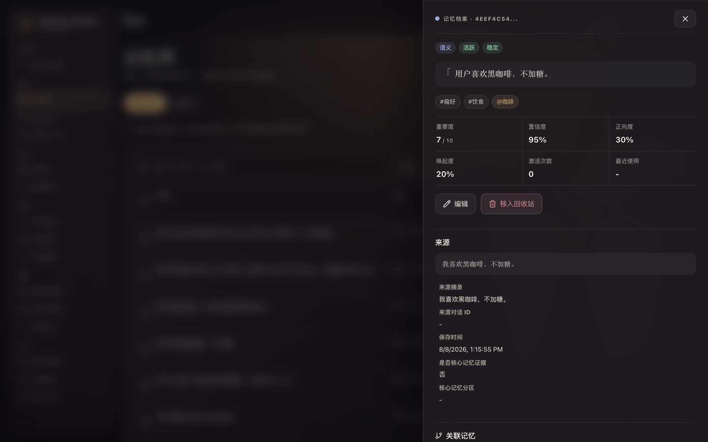

<div align="center">

# 🧠 Memory Platform

**A local-first, auditable, governable long-term memory platform for AI**

Let your AI truly remember you — compatible with MCP and OpenAI Chat Completions

[](https://github.com/SparkHello/Memory_Platform/actions/workflows/ci.yml)
[](https://github.com/SparkHello/Memory_Platform/actions/workflows/docker.yml)
[](https://github.com/SparkHello/Memory_Platform/releases)
[](LICENSE)
[](https://github.com/SparkHello/Memory_Platform/stargazers)

[中文](README.md) · **[English](README.en.md)**

[🚀 Quick start](#-quick-start) · [✨ Core capabilities](#-core-capabilities) · [🧱 Architecture](#-architecture-and-data-flow) · [🔌 Connecting clients](#-connecting-clients) · [📖 Deep review](docs/reviews/JJC-20260805-002-memory-platform-deep-review.md)

</div>

<br>

| Studio | Memory library | Memory detail |
| :---: | :---: | :---: |
| [](docs/images/console-studio.png) | [](docs/images/console-memories.png) | [](docs/images/console-memory-detail.png) |

Memory Platform combines what used to be two separate repositories — `My_Memory` and `Model_Gateway` — into a single monorepo with unified versioning, tests, installation, and migration, while keeping the two services' configuration, secrets, data, and security responsibilities isolated at runtime.

It is not just "a vector store plus prompt stuffing": Memory Gateway owns long-term memory and knowledge governance, while Model Gateway owns provider channels, purpose-based routing, failover, attribution, and cost. They communicate over stable route names with independent local client keys.

## 📖 Contents

- [🧩 Why two gateways](#-why-two-gateways)
- [✨ Core capabilities](#-core-capabilities)
- [🧱 Architecture and data flow](#-architecture-and-data-flow)
- [🧭 Choosing an integration path](#-choosing-an-integration-path)
- [🚀 Quick start](#-quick-start)
- [🔌 Connecting clients](#-connecting-clients)
- [🔐 Configuration and security boundaries](#-configuration-and-security-boundaries)
- [💾 Data, backup, and migration](#-data-backup-and-migration)
- [📁 Repository layout](#-repository-layout)
- [🔧 Development and verification](#-development-and-verification)
- [🎯 Current scope](#-current-scope)
- [📄 License](#-license)

## 🧩 Why two gateways

One model may be served by different channels, billed to different accounts, and used for chat, memory extraction, knowledge retrieval, or embeddings. Writing those provider details directly into the memory service would couple secrets, pricing, failover, and memory logic together.

So Memory Platform keeps two explicit boundaries:

| Service | Default address | Owns | Does not own |
| --- | --- | --- | --- |
| [Memory Gateway](services/memory-gateway/README.md) | `127.0.0.1:2026` | Long-term memory, recent context, isolated knowledge base, MCP, OpenAI-compatible memory proxy, Web Console | Managing vendor accounts and channel pricing |
| [Model Gateway](services/model-gateway/README.md) | `127.0.0.1:2030` | Connections, deployments, routes, fallback, secret references, usage and price snapshots | Storing chat, memory, or knowledge content |

Source and tests live in this repository. Runtime configuration, API keys, SQLite data, logs, and evaluation snapshots stay outside the repository or are git-ignored. Merging the repositories did not merge the sensitive-data boundaries.

## ✨ Core capabilities

### Long-term memory and governance

- Extracts durably useful information from what the user explicitly states. The goal is "don't remember wrong things," not "remember as much as possible."
- Before saving, validates verbatim `source_quote`, fact anchors, subject, relation, object, negation consistency, and sensitivity authorization.
- Five memory sectors: episodic, semantic, procedural, emotional, reflective.
- Lifecycles: dynamic, resolved, archived, pinned — plus decay, activation, surfacing, and two-phase digest.
- Topics, entities, memory spaces, a lightweight network graph, temporal version chains, core memory, and recall explanations.
- Edit, merge, soft-delete, restore, permanently delete, export, health-check, and a closed evaluation loop.

### OpenAI-compatible automatic memory proxy

- Exposes `/v1/models` and `/v1/chat/completions`, so any Chat Completions client can connect.
- Each turn automatically recalls and injects safe memories, then extracts new ones asynchronously after the complete final answer.
- Supports SSE streaming, tool calls, multimodal message parts, `reasoning_content`, usage-only chunks, and transparent pass-through of unknown extension fields.
- Memory modes: `off`, `read`, `read-write`, overridable per request.
- Editing an earlier message or regenerating an answer preserves the conversation branch, so recent context from different branches never bleeds together.

### MCP

- Streamable HTTP MCP at `/mcp`.
- Suited to letting the model explicitly decide when to search, save, surface, or reorganize memory.
- Also exposes browse, search, close-read, upload, and document management tools for the isolated knowledge base.
- MCP and `/v1` can both be enabled, but a single client usually needs only one primary memory path.

### Isolated long-text knowledge base

- Supports text, Markdown, PDF, DOCX, and EPUB.
- Memory and knowledge use separate SQLite files, so long documents never enter memory decay, surfacing, or automatic chat context.
- Immutable document versions, FTS5, chunk embeddings, hybrid retrieval, and exact passage citations.
- The knowledge agent only orchestrates the local index and selects citations. Final content comes from local storage, and instructions inside documents are never executed.

### Model connections, routing, and cost

- Layers client, connection, deployment, route, and pricing separately.
- Routes use stable business names, so Memory Gateway needs no code change when a channel or model changes.
- Ordered fallback per purpose. For streaming responses, switching is only allowed before the first byte — once output starts, another vendor's result is never spliced in.
- Successful responses carry the actual route, deployment, connection, channel, model author, and upstream model attribution.
- Embedding routes enforce a consistent `embedding_space` and dimension, preventing vectors from different spaces being compared.
- The usage database records only identity, routing, status, tokens, latency, and a price snapshot — never prompts, replies, tool arguments, embedding inputs, or knowledge content.

### Web Console

Memory Gateway serves a React Web Console at `/ui/` (screenshots at the top of this page) for:

- viewing, searching, editing, and governing long-term memory;
- inspecting core memory, recent context, timeline, network graph, and recall explanations;
- importing, searching, and managing knowledge documents;
- running health checks, reviews, and recall evaluations;
- viewing model connection status, purpose routes, and a usage overview;
- exporting, backing up, and restoring data.

## 🧱 Architecture and data flow


A `/v1/chat/completions` request roughly goes through:

1. Memory Gateway identifies the current branch from the last user message and visible history.
2. Recalls long-term memory within a timeout budget; falls back safely to keyword search when embeddings are unavailable.
3. Filters private/sensitive content and inserts memories into the initial system region within a character budget.
4. Calls Model Gateway over the `memory.chat` route, which picks the actual deployment and connection.
5. Forwards the response to the client as raw JSON or SSE bytes.
6. Only after a complete final text — with no unfinished tool calls, and not truncated or content-filtered — does it perform idempotent activation, branch persistence, and background memory extraction.

## 🧭 Choosing an integration path

| Goal | Entry point | Who triggers memory |
| --- | --- | --- |
| A Chat Completions client, with automatic recall and saving | `/v1` | Memory Gateway, automatically |
| A client with remote MCP support, model manages memory | `/mcp` | The model, via explicit tool calls |
| Viewing, governing, backing up, evaluating, or hand-editing | `/ui` or REST | You, or a management program |
| Only unified model connections and routing | Model Gateway `/v1` | The caller picks a route |

The knowledge base always requires an explicit MCP, REST, or Web action. It never enters context just because the chat proxy is in use.

## 🚀 Quick start

### Requirements

- Python ≥ 3.12 (`python3.12`, `python3.13`, or any `python3` meeting the floor). CI verifies 3.12 and 3.13.
- Node.js 22 and npm, to build the Web Console.
- The unified install script targets macOS/Linux. Some Windows helper scripts remain inside the services.

### One-command install

From the repository root:

```bash
scripts/setup.sh
```

In a real terminal this prepares Python, installs both services, builds the Web Console, creates and wires the local identities, starts the stack, continues directly into the guided model quickstart, and runs the final checks. Use `scripts/setup.sh --skip-ui` to skip the frontend, or `scripts/setup.sh --install-only` to prepare the stack without configuring a model.

`stack install` initializes configuration outside the repository, creates independent local identities for the two services, securely generates and syncs the backend key, and **auto-generates a client access key (`GATEWAY_API_KEY`), printing it once**. Save it — it is not shown again and is never written to the repository's `.env`. That key is what clients use for `/v1`, MCP, REST, and the Web Console. It differs from the backend key, the admin key, and vendor API keys. Run `scripts/memgw secret set gateway` to rotate it.

### Configuring your first model

The `scripts/setup.sh` flow above already includes model quickstart. To reconfigure a previously installed environment, run:

```bash
services/memory-gateway/.venv/bin/modelgw quickstart
```

It asks only for the channel, API key, and optional semantic-search model. Preset channels read the exact model IDs visible to that key and let you choose one. A single model initially carries every text purpose, then the memory service is wired and restarted automatically. For finer control, run `scripts/memgw` and choose the model configuration menu.

Quickstart includes endpoint presets for DeepSeek, Kimi China, MiMo, and DashScope Beijing. After a hidden API-key prompt it performs one read-only `/models` request and lets you choose from the models that key can actually access; it sends no inference request. For an installed environment, `scripts/setup.sh --configure-only --config <file> --json` skips dependency and stack installation.

For AI-assisted setup, have the agent create a **non-secret** recipe matching [`ai-quickstart.schema.json`](docs/ai-quickstart.schema.json), then run `scripts/setup.sh --config <file> --json`. The provider key is accepted only on stdin, while unknown and secret fields are rejected. See [Installing with an AI assistant](docs/ai-install.md).

Model Gateway's user-facing concepts:

| Concept | Meaning |
| --- | --- |
| Channel / connection | The vendor you actually bought the API from, holding the account and key |
| Model / deployment | The exact upstream model ID on that channel, plus capability declarations |
| Purpose / route | Stable business names like `memory.chat` or `knowledge.fast` |
| Priority | Fallback order when the current deployment is unavailable |
| Pricing | A manually verified official price snapshot bound to a deployment |

The eight recommended routes:

| Route | Purpose |
| --- | --- |
| `memory.chat` | Transparent `/v1` chat proxy |
| `memory.extract` | Long-term memory extraction |
| `memory.compact` | Compacting earlier conversation context |
| `memory.core` | Core memory curation |
| `memory.review` | Memory review and revision suggestions |
| `knowledge.fast` | Fast stage of knowledge retrieval |
| `knowledge.pro` | Escalated stage for complex knowledge retrieval |
| `memory.embedding` | Memory and knowledge embeddings |

### Checking the running state

```bash
scripts/memgw stack status
scripts/memgw stack doctor
```

Common addresses:

| Purpose | URL |
| --- | --- |
| Web Console | `http://127.0.0.1:2026/ui/` |
| Memory Gateway health | `http://127.0.0.1:2026/health` |
| MCP | `http://127.0.0.1:2026/mcp` |
| OpenAI-compatible memory base URL | `http://127.0.0.1:2026/v1` |
| Model Gateway base URL | `http://127.0.0.1:2030/v1` |

Day-to-day you only need the unified entry point:

```bash
scripts/memgw stack start
scripts/memgw stack status
scripts/memgw stack doctor
scripts/memgw stack restart
scripts/memgw stack stop
```

## 🔌 Connecting clients

### OpenAI Chat Completions

A client is typically configured as:

```text
Base URL: http://127.0.0.1:2026/v1
API Key:  the GATEWAY_API_KEY printed by stack install (or set via memgw secret set gateway)
Model:    memory-auto
```

Chatbox / RikkaHub users who just need the three fields above can follow the step-by-step [客户端接入指南](docs/client-setup.md)（中文）.

On a phone, `localhost` points at the phone itself. Phone or LAN clients should use the LAN/Tailscale address of the machine running Memory Platform, and Memory Gateway must bind to an interface that permits access. **Do not expose the service to the public internet without authentication.**

`X-Memory-Mode` selects:

- `off` — transparent proxy only;
- `read` — recall and inject memory, but extract nothing new;
- `read-write` — recall, inject, and extract new memory after the complete final answer.

Full streaming, tool-call, conversation-branch, and client-compatibility notes are in the [Memory Gateway README](services/memory-gateway/README.md).

### MCP

The remote Streamable HTTP MCP endpoint is:

```text
http://127.0.0.1:2026/mcp
```

Apart from the health endpoint, MCP, REST, Web Console APIs, and `/v1` all use Memory Gateway's bearer token.

## 🔐 Configuration and security boundaries

### Keys and identity

Several distinct keys exist and must not be reused across purposes:

| Key | Purpose | Stored in |
| --- | --- | --- |
| Memory Gateway API key | Client access to `/v1`, MCP, REST, and Web Console APIs | Memory Gateway user config directory |
| Model Gateway backend key | Memory Gateway calling permitted `memory.*` / `knowledge.*` routes | A file outside the repo on each side |
| Model Gateway admin key | Changing channel secrets and route configuration | Admin-side only, never persisted by Memory Gateway |
| Provider API key | Calling the real upstream channel | Model Gateway's `secrets.env` outside the repo |

`GATEWAY_API_KEY` is bound to a fixed `GATEWAY_USER_ID` by default; callers cannot rewrite the namespace via `X-User-Id`. `GATEWAY_ALLOW_USER_ID_HEADER=true` exists only for migrating away from an older shared key, and is not recommended on untrusted networks.

### Sensitive data egress

- `ALLOW_SENSITIVE_EGRESS=false` (the default) blocks content locally classified as private/sensitive from reaching remote memory extraction, embeddings, AI review, and the knowledge agent.
- That switch does not intercept the current message a user deliberately sends upstream through `/v1`.
- `redact_sensitive=true` masks only the current response. It does not rewrite the SQLite content, and it does not make backups redacted.
- Memory and knowledge embeddings must carry a trusted, consistent space ID. When it is missing or mismatched, the system falls back to keyword/FTS rather than assuming old vectors belong to the current space.

### Deployment boundary

The current default target is a personal machine or a trusted home network:

- SQLite, caches, tool idempotency, and some background state are designed for a single process;
- the default deployment should not be treated as a public multi-tenant SaaS;
- Model Gateway's admin interface listens on loopback only by default, and cross-host exposure must sit behind HTTPS;
- for strong isolation, use separate credentials and instances per user rather than a shared key with a mutable `X-User-Id`.

## 💾 Data, backup, and migration

### Where the data lives

The repository holds only source code and non-sensitive examples. Actual runtime data lives in your user config directory: long-term memory, recent context and branch nodes, the isolated knowledge base and document versions, Model Gateway configuration, the usage database and price snapshots, plus each service's own key file and logs.

Never commit `.env`, real SQLite files, logs, evaluation snapshots, or portable backups.

### Portable backup

```bash
scripts/memgw stack backup --output memory-stack.zip
```

The archive contains the migratable memory database, knowledge database, redacted Model Gateway configuration, usage database, and non-secret settings. It excludes provider keys, the admin key, the backend key, and the Memory Gateway API key.

Even without keys, the archive still contains your complete private memory and knowledge content. Treat it as a sensitive file.

Restoring onto a new machine:

```bash
git clone <your-repository-url> Memory_Platform
cd Memory_Platform
scripts/setup.sh
scripts/memgw stack restore /path/to/memory-stack.zip --yes --start
```

Restore verifies manifest hashes, SQLite, and JSON, stops both services, and creates rollback copies outside the repository for any local file it replaces. Afterwards you must re-enter the keys that were excluded from the backup.

## 🔁 direct-provider compatibility mode

If you are not running a separate Model Gateway yet, Memory Gateway still supports the older `UPSTREAM_*`, `LLM_*`, `memgw model`, `memgw route`, and `memgw pricing` paths.

New deployments should use Model Gateway. As long as `MODEL_GATEWAY_BASE_URL` and `MODEL_GATEWAY_API_KEY` are configured as a pair, chat, background memory tasks, the knowledge agent, and embeddings only call stable routes, and will not silently fall back to old `.env` provider keys when central routing fails.

## 📁 Repository layout

```text
Memory_Platform/
├── services/
│   ├── memory-gateway/       Long-term memory, knowledge base, MCP, /v1 proxy, Web Console
│   │   ├── app/              FastAPI, memory, knowledge, LLM, MCP, usage, CLI
│   │   ├── ui/               React / TypeScript / Vite console
│   │   ├── tests/            Memory Gateway tests
│   │   └── docs/             Integration, algorithm, and product docs
│   └── model-gateway/        Connections, deployments, routes, pricing, usage
│       ├── model_gateway/    Service, transparent proxy, routing, config, admin, CLI
│       ├── tests/            Model Gateway tests
│       └── docs/             Configuration, protocol, operations, LiteLLM evaluation
├── scripts/
│   ├── setup.sh              One-command first-run setup
│   ├── bootstrap.sh          Create the unified dev environment and build the frontend
│   ├── memgw                 Unified entry point for both services
│   └── test.sh               Both backend test suites plus the frontend production build
├── docs/
│   ├── ai-install.md         Zero-interaction install path for AI assistants
│   └── reviews/              Cross-service evaluation and audit reports
├── AGENTS.md                 Repository development and security boundaries
├── LICENSE                   Apache-2.0
└── README.md
```

The two services share git history but keep separate runtime configuration, processes, and databases. Do not run `git init` again under `services/`.

## 🔧 Development and verification

Install the development environment:

```bash
scripts/bootstrap.sh
```

Run the full gate:

```bash
scripts/test.sh
```

That runs Memory Gateway pytest, Model Gateway pytest, then the Web Console TypeScript check and Vite production build.

Targeted tests:

```bash
cd services/memory-gateway
.venv/bin/python -m pytest tests/test_chat_gateway.py

cd ../model-gateway
../memory-gateway/.venv/bin/python -m pytest tests/test_service.py
```

For frontend-only changes, at minimum run:

```bash
cd services/memory-gateway/ui
npm run build
```

Tests must use fake providers, `httpx.MockTransport`, and temporary directories. They must never call real vendors or modify a real `memory.db`, `knowledge.db`, or user config directory. See the root [AGENTS.md](AGENTS.md) and each service's own `AGENTS.md`.

## 🎯 Current scope

Memory Platform currently suits:

- personal AI assistants and trusted local networks;
- chat clients that need auditable, editable, deletable memory;
- local memory infrastructure serving both OpenAI-compatible and MCP clients;
- knowledge workbenches with explicit requirements around sensitive-data egress, channel attribution, and vector-space consistency.

It does not currently target:

- public multi-tenant SaaS without additional hardening;
- low-latency ANN retrieval over millions of memories;
- strongly consistent, cross-process task queues and caches;
- full entity disambiguation, bitemporal modeling, or deep multi-hop reasoning graphs;
- a complete proxy for OpenAI Responses, audio, files, or image generation.

## 📚 Further reading

- [Contributing](CONTRIBUTING.md)
- [Security policy](SECURITY.md)
- [Changelog](CHANGELOG.md)
- [Memory Gateway full documentation](services/memory-gateway/README.md)
- [Model Gateway full documentation](services/model-gateway/README.md)
- [Installing with an AI assistant](docs/ai-install.md)
- [Client integration](services/memory-gateway/docs/client_integration.md)
- [客户端接入指南（Chatbox / RikkaHub 等）](docs/client-setup.md)
- [Model Gateway configuration standard](services/model-gateway/docs/configuration.md)
- [Model Gateway client protocol](services/model-gateway/docs/client-protocol.md)
- [Operations, background services, and health checks](services/model-gateway/docs/operations.md)

## 📄 License

Licensed under the [Apache License 2.0](LICENSE).
