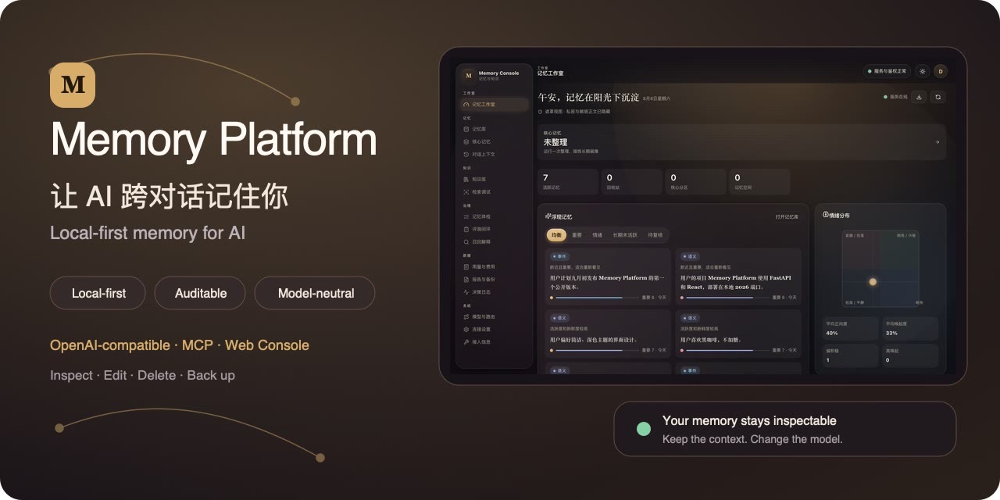
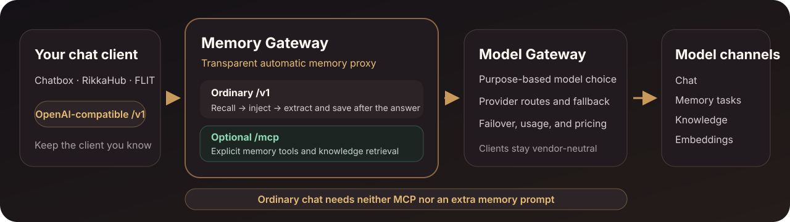
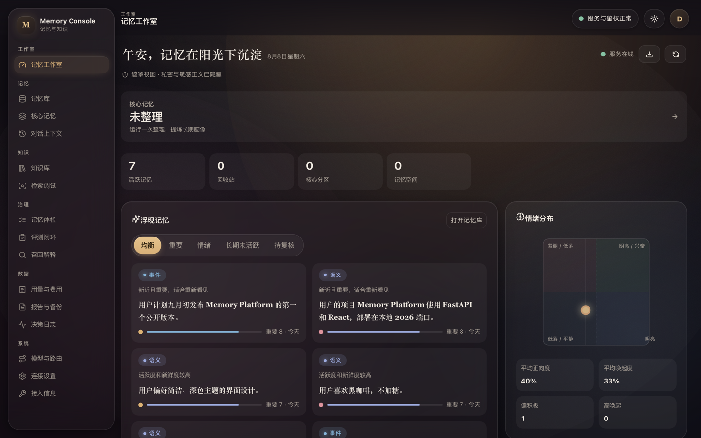
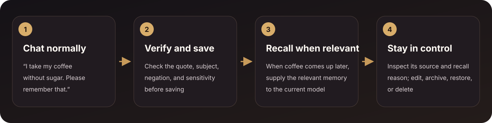
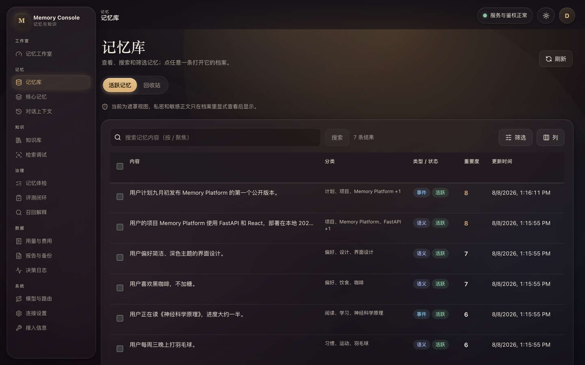

<div align="center">

# 🧠 Memory Platform

**Add an automatic, local memory gateway to the AI client you already use.**

For ordinary chat, connect to the OpenAI-compatible `/v1` endpoint: Memory Platform recalls relevant memory, injects context, and extracts durable information after a complete answer.<br>
**No MCP setup and no extra “remember this” prompt are required.** MCP remains available for explicit memory organization and knowledge retrieval.

Memory stays on your own device, where you can inspect, edit, delete, and back it up. Providers, routes, and failover are managed server-side.

[](https://github.com/SparkHello/Memory_Platform/releases)
[](https://github.com/SparkHello/Memory_Platform/actions/workflows/ci.yml)
[](LICENSE)

[中文](README.md) · **[English](README.en.md)**

[🔀 How it works](#-two-gateway-layers-automatic-ordinary-chat) · [🧭 Why Memory Platform](#-why-memory-platform) · [🚀 Get started](#-quick-start) · [🔌 Connect a client](#-connecting-clients) · [📚 Docs](#-documentation)

</div>



<p align="center"><sub>Automatic memory gateway · Local-first · Auditable · Model-neutral · All product screens use demo data, never real user content</sub></p>

## ✨ The one-minute version

| What you may want to know first | Short answer |
| --- | --- |
| **What does it do?** | It is an automatic memory gateway between a chat client and a model: it recalls and injects relevant memory, then extracts durable information after a complete answer. |
| **Who is it for?** | People using Chatbox, RikkaHub, FLIT, or another OpenAI-compatible client who want durable preferences and project context. |
| **Where is the data?** | Memory, knowledge documents, and runtime configuration remain local; Docker separates them into Memory/Model data and secret volumes. |
| **Must I change clients?** | No. Point your current client's Base URL at Memory Platform's OpenAI-compatible `/v1` endpoint. |
| **Do I need MCP or a memory prompt?** | Not for ordinary chat. The gateway handles recall and saving automatically; `/mcp` is only for explicit memory organization and knowledge retrieval. |
| **Does it lock me to a model?** | No. Clients use `memory-auto`; provider and model changes stay on the server. |
| **What is the fastest path?** | Start Docker → configure a model in the browser → enter a Base URL, API key, and model name in your client. |

Memory Platform is not a new chat client and does not include a model. The embedding route is optional; leaving it absent or disabled explicitly selects keyword retrieval.

> [!IMPORTANT]
> **Local-first does not mean no network traffic.** Memory, knowledge documents, and configuration stay on your device by default. If you choose a cloud model provider, the current message you send and the context permitted for that turn are sent to that provider for inference. The default deployment targets a personal machine or trusted home network; do not expose it unauthenticated to the public internet.

## 🔀 Two gateway layers, automatic ordinary chat



Clients connect only to Memory Gateway. For ordinary `/v1` requests, the gateway automatically recalls memory, injects context, and extracts durable information after the answer; it does not depend on the model remembering to call a tool. Model Gateway selects providers, models, and fallback order by stable purpose. Add `/mcp` only when the model should explicitly search or organize memory or retrieve knowledge.

## 🧭 Why Memory Platform

- **Gateway-managed memory instead of waiting for tool calls:** ordinary OpenAI-compatible chat gets automatic recall, injection, and saving; neither MCP nor an extra memory prompt is a prerequisite.
- **Keep your current chat entry point:** change only the Base URL, API key, and model name, then continue using the client you already know.
- **Governance before “remember more”:** every memory keeps its source and status, explains why it was recalled, and can be edited, archived, restored, or permanently deleted.
- **Memory and knowledge stay physically separate:** personal facts and preferences live in `memory.db`; imported long-form documents live in `knowledge.db` and never enter memory decay or automatic chat context.
- **Model choices stay server-side:** Model Gateway selects providers, models, and fallback order by stable purpose, so clients and memory data do not migrate with a vendor change.

These projects solve different layers of the problem. Start with the one closest to your primary goal:

| Your primary goal | Start with |
| --- | --- |
| Add a general-purpose memory SDK, server API, or managed platform to an application | [Mem0](https://github.com/mem0ai/mem0) |
| Build a temporal context graph centered on entities, fact validity, and historical queries | [Zep / Graphiti](https://github.com/getzep/graphiti) |
| Build a stateful agent runtime in which the agent manages its own memory, state, and tools | [Letta](https://github.com/letta-ai/letta) |
| Keep an existing OpenAI-compatible client while adding gateway-managed automatic memory, local deployment, auditable governance, isolated knowledge, and unified model routing | **Memory Platform** |

This is not a performance ranking. Memory Platform currently targets personal machines and trusted home networks; it does not try to replace a managed memory platform, a full temporal knowledge graph, or an agent runtime.

## 🚀 Quick start

### Easiest path: one-line installer (Docker)

You need Docker Desktop and an API key for one model provider. You do not need Python, Node.js, or a repository clone.

Choose a released version instead of tracking the mutable `main` branch. On macOS or Linux:

```bash
VERSION=v0.5.1
curl -fsSL "https://raw.githubusercontent.com/SparkHello/Memory_Platform/$VERSION/deploy/install.sh" -o install-memory-platform.sh
MEMORY_PLATFORM_VERSION="$VERSION" sh install-memory-platform.sh
```

Windows PowerShell uses the matching release installer (currently **experimental**: it passed PowerShell syntax regression and containerized fault-injection tests, but has not yet completed a disaster-recovery drill on a real NTFS + Docker Desktop machine — keep an extra manual backup of important data):

```powershell
$Version = "v0.5.1"
$env:MEMORY_PLATFORM_VERSION = $Version
irm "https://raw.githubusercontent.com/SparkHello/Memory_Platform/$Version/deploy/install.ps1" -OutFile install-memory-platform.ps1
& .\install-memory-platform.ps1
```

After installation, remember two credential files and three steps:

1. Sign in to the Web Console at `http://127.0.0.1:2026/ui/` with the token in `credentials/gateway.txt` (legacy installs may use `gateway.key`);
2. Open Models & Routes and enter the admin key from `credentials/admin.txt` (legacy `admin.key`) to configure a model channel;
3. Create a chat token in the Web Console and paste it into your chat client.

First start takes 1–2 minutes; chat works once a model channel is configured. Before first-run setup, `/health` returning 200 while `/readyz` returns 503 is expected: liveness keeps the setup UI reachable, while readiness means the stack is operationally configured. Credential values are never printed to Docker logs or passed through Compose environment variables — they live only in owner-only files under `credentials/`.

To uninstall, see [Stack operations · Uninstall a Docker install](docs/stack-operations.en.md#uninstall-a-docker-install). Do not run `docker system prune`.

<details>
<summary>Installer implementation details (digest pinning, backup and upgrade strategy)</summary>

The installer checks Docker, uses a stable per-user install directory, picks a free port, pins every image to its immutable digest, and opens browser-based onboarding. Re-running the same release installer finds the existing installation; on upgrade it stops the old stack, creates and verifies a single consistent backup, then rolls back automatically if an already configured stack regresses at `/readyz`. A fresh install requires only `/health` so that onboarding remains reachable. The default directory is `~/memory-platform` on macOS/Linux or `$HOME\memory-platform` on Windows. Sigstore signature verification is skipped by default (images are already digest-pinned); set `MEMORY_VERIFY_SIGNATURES=1` to enable it. Legacy all-in-one single-volume layouts are no longer migrated by the installer itself: run the one-shot migration tool from the same release first (`curl -fsSL "https://raw.githubusercontent.com/SparkHello/Memory_Platform/$VERSION/deploy/legacy_cutover.py" -o legacy-cutover.py && python3 legacy-cutover.py`), then re-run the installer once the four split volumes exist.

If GHCR or GitHub is unreachable from your network, set an HTTPS proxy before re-running the script, or set `MEMORY_IMAGE_REGISTRY=<ghcr-mirror-host>` to pull the images through a GHCR mirror (only the registry host changes; repository paths and digest pinning stay identical).

</details>

### Manual path (to review each step)

```bash
VERSION=v0.5.1
curl -O "https://raw.githubusercontent.com/SparkHello/Memory_Platform/$VERSION/deploy/docker-compose.user.yml"
docker compose -f docker-compose.user.yml up -d
```

The release Compose file starts separate Memory, Model, and one-shot initializer images. The installer resolves the selected semver images to immutable digests; do the same when maintaining a manual deployment. The [GHCR package page](https://github.com/SparkHello/Memory_Platform/pkgs/container/memory-platform) lists versions and digests.

First start takes 1–2 minutes of offline initialization, during which `http://127.0.0.1:2026/ui/` is not reachable yet — that is expected. Generated credentials are host files, not log output:

```bash
ls -l credentials/gateway.txt credentials/admin.txt
```

On a fresh install, `gateway.txt` contains the sole Console-scoped `first-console` token. Only migrated legacy volumes retain a one-version all-scope bootstrap key; older installations may still use `gateway.key`. The Web Console can create separate chat and MCP device tokens after login. `admin.txt` (legacy `admin.key`) is used only to change model channels and routes in the browser. If port 2026 is already taken, write `MEMORY_PORT=3026` into a `.env` file next to the Compose file and restart (see the [stack operations guide](docs/stack-operations.en.md#port-2026-already-in-use)).

Then:

1. Open `http://127.0.0.1:2026/ui/` and connect with the value in `credentials/gateway.txt` (or legacy `gateway.key`).
2. Open Models & Routes and use the admin key to unlock this configuration session.
3. Add a channel, enter the provider API key, and choose a model from the discovered list.
4. Follow [Connecting clients](#-connecting-clients) below for the Base URL, API key, and model name.

Image upgrades preserve the four isolated data/secret volumes. Daily commands, scoped-token management, backup, and migration are in the [stack operations guide](docs/stack-operations.en.md).

### Install from source

For macOS or Linux, with Python 3.12+, Node.js 22, and npm:

```bash
git clone https://github.com/SparkHello/Memory_Platform.git
cd Memory_Platform
scripts/setup.sh
```

The setup script prepares the environment, builds the Web Console, starts the stack, generates local keys, and opens guided model setup. Use `scripts/setup.sh --install-only` to prepare the environment only, or add `--skip-ui` if you do not need the Web Console.

An AI or agent can instead follow [Installing with an AI assistant](docs/ai-install.md) (Chinese), create a non-secret recipe, and call `scripts/setup.sh --config <file> --json`. The provider API key is passed only through standard input.

## 🔌 Connecting clients

Add a new “OpenAI-compatible” provider in Chatbox, RikkaHub, FLIT, or another client:

```text
Base URL: http://127.0.0.1:2026/v1
API Key:  a per-device chat token created in the Web Console or CLI
Model:    memory-auto
```

After one complete message, open `http://127.0.0.1:2026/ui/` to check whether a memory was created. When you later change providers or models, only the server configuration changes; the client keeps using `memory-auto`.

Ordinary chat does not require MCP or a system prompt telling the model when to save memory. In the default `read-write` mode, Memory Gateway handles relevant-memory recall, context injection, and post-answer extraction automatically.

On a phone, `localhost` and `127.0.0.1` point to the phone itself. LAN or Tailscale devices must use the address of the computer running Memory Platform; Docker deployments also need `MEMORY_HOST=0.0.0.0` in a `.env` file next to the Compose file, plus a restart, to listen on the LAN. Field locations, verification, and troubleshooting are covered in the [client setup guide](docs/client-setup.md) (Chinese).

### Optional MCP: let the model use memory and knowledge explicitly

Clients that support Streamable HTTP MCP can connect to:

```text
http://127.0.0.1:2026/mcp
```

Authenticate with a separate per-device MCP token. MCP is useful when the model should explicitly search, save, or organize memory and retrieve documents you deliberately imported. It is an enhancement, not a prerequisite for automatic memory. For ordinary chat, the OpenAI-compatible endpoint above is enough.

| What you want to do | Entry point | Who decides when to use memory |
| --- | --- | --- |
| Recall and save automatically in a normal chat client | `/v1` | Memory Platform handles it automatically |
| Let the model search, save, or organize explicitly | `/mcp` | The model calls tools |
| Inspect, edit, delete, import, or back up | `/ui` | You act in the browser |
| Use only unified model routing | Model Gateway `/v1` | The caller selects a purpose |

The knowledge base never enters chat context automatically. It requires an explicit MCP, REST, or Web Console search.

## 🖥️ Visible and governable

### One workspace for context, memory, and related topics



<p align="center"><sub>See the current context, durable core memory, and the reason each item was recalled.</sub></p>

### How a conversation becomes long-term memory



The system waits for a complete answer, checks the original wording, subject, negation, and sensitivity, and only then decides whether to save. Truncated, filtered, or unfinished tool-call responses do not create memory.

You do not need to append “remember this” to each message. The system conservatively extracts durable information only from content the user actually expressed.

### Search and govern the whole memory library



<p align="center"><sub>All screens use demo data. Search, filter, pin, archive, restore, and permanently delete from the local Web Console.</sub></p>

## 🧰 Core capabilities

- **Automatic memory gateway with optional MCP:** ordinary `/v1` chat gets automatic recall, injection, and saving, with streaming, tool-call, multimodal-part, and reasoning-field compatibility plus `off` / `read` / `read-write` modes and conversation branches.
- **Long-term memory and governance:** verifiable source text, lifecycles, timelines, topic links, recall explanations, edit, merge, soft delete, restore, permanent deletion, and export.
- **Isolated knowledge base:** text, Markdown, PDF, DOCX, and EPUB with full-text/vector hybrid retrieval, immutable document versions, and exact passage citations.
- **Models, failover, and usage:** purpose-based model selection and fallback, with channel, model, token, latency, and price snapshots but no prompts, replies, tool arguments, or knowledge content in usage logs.
- **Optional, strict vector capability:** a missing or disabled `memory.embedding` route uses keyword retrieval. Enabling it opts into semantic vectors; a blank space setting automatically adopts the route contract, while an invalid, unavailable, or pin-mismatched contract makes `/readyz` fail instead of mixing old vector spaces. Sensitive content is excluded from remote extraction, embeddings, AI review, and the knowledge agent by default.

The complete interface and behavior contracts are documented in [Memory Gateway](services/memory-gateway/README.md) and [Model Gateway](services/model-gateway/README.md).

## 🧱 Two gateways, one installation

| Service | Default address | Owns | Does not own |
| --- | --- | --- | --- |
| [Memory Gateway](services/memory-gateway/README.md) | `127.0.0.1:2026` | Long-term memory, recent context, knowledge base, MCP, OpenAI-compatible proxy, and Web Console | Provider accounts and channel pricing |
| [Model Gateway](services/model-gateway/README.md) | Docker-internal `model-gateway:2030` | Model connections, purpose routes, fallback order, secret references, usage, and price snapshots | Chat, memory, or knowledge content |

Memory behavior and model-provider configuration have different change rates and security responsibilities, so they run in separate containers and OS identities. Model Gateway is not published to the host; Memory Gateway calls it over a private backend network through exact stable routes and a separate backend key. Memory cannot mount provider or admin secrets.

## 🔐 Current boundaries

- The default target is a personal machine or trusted home network, not an unhardened public multi-tenant SaaS.
- SQLite, caches, tool idempotency, and some background state are designed for one process; low-latency ANN retrieval over millions of memories is not a current goal.
- Topic, entity, and temporal links are lightweight and are not a substitute for full entity resolution, a bitemporal knowledge graph, or deep multi-hop reasoning.
- The OpenAI-compatible entry point focuses on Chat Completions; it is not a complete proxy for Responses, audio, files, or image generation.
- Backups exclude keys but still contain complete private memory and knowledge content, so they remain sensitive files.

Key boundaries, sensitive-data egress, backup and restore, and advanced model configuration are covered in the [stack operations guide](docs/stack-operations.en.md).

## 📚 Documentation

- [Client setup for Chatbox, RikkaHub, FLIT, and similar clients](docs/client-setup.md) (Chinese)
- [Stack operations, advanced configuration, backup, and migration](docs/stack-operations.en.md)
- [Installing with an AI assistant](docs/ai-install.md) (Chinese)
- [Memory Gateway full documentation](services/memory-gateway/README.md)
- [Model Gateway full documentation](services/model-gateway/README.md)
- [Contributing](CONTRIBUTING.md)
- [Security policy](SECURITY.md)
- [Changelog](CHANGELOG.md)

## 📄 License

Licensed under the [Apache License 2.0](LICENSE). Keep the license file and copyright notices when using, modifying, or redistributing the project.
