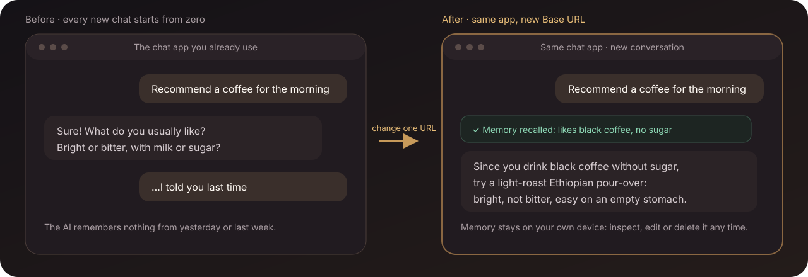

<div align="center">

# 🧠 Memory Platform

**Make the AI chat app you already use remember you. New window, different model, it still remembers.**

A memory relay that runs on your own phone or computer: point your chat app at it,<br>
and every conversation automatically carries the relevant memories, then saves what is worth keeping afterwards. No plugin, no repeated “remember this”.

[](https://github.com/SparkHello/Memory_Platform/releases)
[](https://github.com/SparkHello/Memory_Platform/actions/workflows/ci.yml)
[](LICENSE)

[中文](README.md) · **[English](README.en.md)**

<br>

[<kbd>&nbsp;📱 &nbsp;On your phone: Android app&nbsp;</kbd>](#-on-your-phone-android-app) &nbsp;&nbsp; [<kbd>&nbsp;💻 &nbsp;On your computer: Docker one-liner&nbsp;</kbd>](#-on-your-computer-docker-one-liner)

<sub>[🔌 What to enter in the chat app](#-what-to-enter-in-the-chat-app) · [🔑 Three keys](#-three-keys) · [🖥️ Visible and governable](#️-visible-and-governable) · [🔬 Going deeper](#-going-deeper) · [📚 Docs](#-documentation)</sub>

</div>



<p align="center"><sub>Illustration. Memory stays on your own device, where you can inspect, edit, delete and back it up.</sub></p>

## ✨ The problem it solves

Every new chat window forgets you: yesterday's preferences, the project you are working on, your family's names. Memory Platform sits between your chat app and the model and handles that automatically:

| What you may want to know | Short answer |
| --- | --- |
| **Do I have to switch chat apps?** | No. Chatbox, RikkaHub, FLIT or any app with an “OpenAI-compatible” provider works; you change three fields: address, key, model name. |
| **Do I have to say “remember this”?** | No. After the AI finishes a complete answer it decides on its own whether the turn contained something worth keeping. Passwords and ID numbers are never saved unless you explicitly ask. |
| **Where is the data?** | On your own phone or computer (SQLite files). Search, edit, delete and export from a local web console. |
| **Do I start over when I change models?** | No. The chat app always uses the model name `memory-auto`; which provider answers is changed in the console. |
| **What do I need?** | An Android phone, or a computer with Docker, plus an API key from one model provider (the wizard links to where to get one). |

> [!IMPORTANT]
> **Local-first does not mean offline.** Memory, documents and configuration stay on your device, but the message you send and the memories allowed for that turn are sent to the model provider you chose. The default deployment targets a personal machine or trusted home network; do not expose it unauthenticated to the public internet.

## 🚀 Quick start

### 📱 On your phone: Android app

The lowest-friction path. The whole stack runs inside one app in the background; chat apps on the same phone connect to it. No computer needed.

1. Download `memory-platform-android-*.apk` (arm64, Android 8.0+) from [Releases](https://github.com/SparkHello/Memory_Platform/releases) and allow installs from unknown sources.
2. Open the app, tap **Start service** and allow notifications. The status page is a four-step checklist that ticks itself off.
3. Tap **Open console to configure a model**. The browser **signs in automatically** (nothing to copy or paste); pick a provider, paste its API key, choose a chat model, save.
4. Back in the app, tap **Open console to create a chat key** and create one under *Client access*.
5. In your phone's chat app add an “OpenAI-compatible” provider: Base URL `http://127.0.0.1:2026/v1`, API key = the chat key you just created, model `memory-auto`. The status page has copy buttons for the address and the model name.
6. If a red **Background may be restricted** card appears, tap **Disable battery optimization**. Xiaomi, Huawei, OPPO, vivo and similar systems additionally need auto-start permission, an unrestricted power policy and locking the app in recents; otherwise the service gets killed and memories are silently lost.

Once everything is ticked, the console home shows a **Try it** card: send the suggested test sentence and the card shows live whether the first memory was saved. If something goes wrong, **Export diagnostics** under *Advanced* bundles logs, redacted config and a memory database snapshot.

Under the hood it embeds Python 3.14 via Chaquopy, runs the same server code, ships an FTS5-enabled SQLite and listens on `127.0.0.1` only. Build steps, known limits and troubleshooting: [Android client guide](docs/android.md) (Chinese).

### 💻 On your computer: Docker one-liner

You need Docker Desktop and an API key from one model provider. No Python, Node.js or repository clone.

macOS or Linux (pin the version to the release you want):

```bash
VERSION=v0.5.1
curl -fsSL "https://raw.githubusercontent.com/SparkHello/Memory_Platform/$VERSION/deploy/install.sh" -o install-memory-platform.sh
MEMORY_PLATFORM_VERSION="$VERSION" sh install-memory-platform.sh
```

Windows PowerShell 5.1+ (also pinned to a release):

```powershell
$Version = "v0.5.1"
irm "https://raw.githubusercontent.com/SparkHello/Memory_Platform/$Version/deploy/install.ps1" -OutFile install-memory-platform.ps1
$env:MEMORY_PLATFORM_VERSION = $Version
powershell.exe -NoProfile -ExecutionPolicy Bypass -File .\install-memory-platform.ps1
```

The Windows installer is still marked experimental: keep an extra manual backup of important data and read the [stack operations guide](docs/stack-operations.en.md) first.

After installation there are two key files under `credentials/` in the install directory, then three steps:

1. Open `http://127.0.0.1:2026/ui/` and paste the **login key** from `credentials/gateway.txt` (legacy installs: `gateway.key`).
2. Open *Models & Routes*, paste the **admin key** from `credentials/admin.txt`, add a channel, paste the provider API key, pick a model.
3. Create a **chat key** under *Client access* and enter it in your chat app as described in [What to enter in the chat app](#-what-to-enter-in-the-chat-app).

First start takes 1–2 minutes. Before a model is configured, `/health` returning 200 while `/readyz` returns 503 is expected: the former keeps the setup page reachable, the latter means chat is ready. Key values never enter environment variables, command arguments or Docker logs; they only live in owner-only files under `credentials/`.

To uninstall, see [Stack operations · Uninstall a Docker install](docs/stack-operations.en.md#uninstall-a-docker-install). Do not run `docker system prune`.

<details>
<summary>Installer details, manual Compose, install from source</summary>

**Installer**: it checks Docker, uses a stable per-user install directory, picks a free port, pins every image to its immutable digest, and opens browser-based onboarding. Re-running the same release installer finds the existing installation; on upgrade it stops the old stack, creates and verifies a single consistent backup, then rolls back automatically if an already configured stack regresses at `/readyz`. A fresh install requires only `/health`. The default directory is `~/memory-platform` on macOS/Linux or `$HOME\memory-platform` on Windows. Sigstore signature verification is skipped by default (images are digest-pinned); set `MEMORY_VERIFY_SIGNATURES=1` to enable it. Legacy all-in-one single-volume layouts are no longer migrated by the installer itself: run the one-shot migration tool from the same release first (`curl -fsSL "https://raw.githubusercontent.com/SparkHello/Memory_Platform/$VERSION/deploy/legacy_cutover.py" -o legacy-cutover.py && python3 legacy-cutover.py`), then re-run the installer. If GHCR or GitHub is unreachable, set an HTTPS proxy before re-running, or set `MEMORY_IMAGE_REGISTRY=<ghcr-mirror-host>` (only the registry host changes; paths and digests stay identical).

**Manual Compose** (to review each step):

```bash
VERSION=v0.5.1
curl -O "https://raw.githubusercontent.com/SparkHello/Memory_Platform/$VERSION/deploy/docker-compose.user.yml"
mkdir -m 700 credentials
printf 'HOST_UID=%s\nHOST_GID=%s\n' "$(id -u)" "$(id -g)" > .env
docker compose -f docker-compose.user.yml up -d
```

The release Compose file starts separate Memory, Model and one-shot initializer images built from one hash-verified artifact set; they do not share a complete Python environment. The [GHCR package page](https://github.com/SparkHello/Memory_Platform/pkgs/container/memory-platform) lists versions and digests. Once ready, `ls -l credentials/gateway.txt credentials/admin.txt` shows the two keys. On a fresh install the login key is the sole Console-scoped `first-console` token; only migrated legacy volumes keep a one-version all-scope key. If port 2026 is taken, write `MEMORY_PORT=3026` into `.env` next to the Compose file and restart. Image upgrades preserve the four isolated data/secret volumes.

**Install from source** (macOS or Linux, Python 3.12+, Node.js 22 and npm):

```bash
git clone https://github.com/SparkHello/Memory_Platform.git
cd Memory_Platform
scripts/setup.sh
```

The setup script prepares the environment, builds the Web Console, starts the stack, generates local keys and opens guided model setup. Use `--install-only` to prepare the environment only, or `--skip-ui` without the Web Console. An AI or agent can instead follow [Installing with an AI assistant](docs/ai-install.md) (Chinese) and call `scripts/setup.sh --config <file> --json`; the provider API key is passed only through standard input.

</details>

## 🔌 What to enter in the chat app

Add an “OpenAI-compatible” provider in Chatbox, RikkaHub, FLIT or a similar app and fill in three fields:

```text
Base URL: http://127.0.0.1:2026/v1
API Key:  the chat key created for this device under Client access in the console
Model:    memory-auto
```

Then send one message with a personal preference, for example “I like black coffee, no sugar, keep that in mind when you recommend coffee”, and let the AI finish its answer. The memory appears in the console; open a new conversation and ask “what coffee do I like?”.

- **On a phone, `127.0.0.1` means the phone itself.** With the Android app installed that is exactly the address to use. To reach a computer instead, use the computer's LAN address; Docker deployments also need `MEMORY_HOST=0.0.0.0` in `.env` next to the Compose file plus a restart.
- **For a conversation that should leave no trace**, switch the model name to `memory-read` (recall only, never writes) or `memory-off` (no reads, no writes). No custom-header support needed.
- **When you change providers later**, change it in the console only; the chat app stays as is.

Per-app field locations, verification and troubleshooting: [client setup guide](docs/client-setup.md) (Chinese).

## 🔑 Three keys

There are exactly three keys, each for one job. Do not mix them up:

| Key | Where | Purpose | Android app |
| --- | --- | --- | --- |
| **Login key** | `credentials/gateway.txt` (legacy `gateway.key`) | Sign in to the web console | Carried automatically by **Open console** |
| **Admin key** | `credentials/admin.txt` (legacy `admin.key`) | Change model channels on *Models & Routes* | Carried automatically by **Open console** |
| **Chat key** | Created under *Client access*, shown once | The API key inside the chat app | Create in the console, then copy |

Every chat app gets its own chat key, so losing one device means revoking one key. MCP-capable clients get a separate MCP key. Provider API keys stay on the server and are never handed to chat apps.

## 🖥️ Visible and governable

### One workspace for context, memory, and related topics


<p align="center"><sub>See the current context, durable core memory, and the reason each item was recalled.</sub></p>

### How a conversation becomes long-term memory


The system waits for a complete answer, checks the original wording, subject, negation, and sensitivity, and only then decides whether to save. Truncated, filtered, or unfinished tool-call responses do not create memory; turns that are only greetings, questions, or code are skipped by a local prefilter without calling the extraction model.

You do not need to append “remember this” to each message. The system conservatively extracts durable information only from content the user actually expressed. Private facts such as health, address, contact details, and income are saved automatically and injected into chat only when clearly relevant to the current question; passwords, government IDs, and bank/account numbers still require an explicit request to remember and are never injected into chat.

Sensitivity filtering is per sentence: by default (`ALLOW_SENSITIVE_EGRESS=false`) only sentences containing passwords, IDs, or account numbers are withheld from the extraction model while the rest of the turn is extracted normally; such a sentence next to “remember” is saved locally verbatim without any model call.

### Search and govern the whole memory library


<p align="center"><sub>All screens use demo data. Search, filter, pin, archive, restore, and permanently delete from the local Web Console.</sub></p>

## 🔬 Going deeper

### Two gateway layers, automatic ordinary chat


Clients connect only to Memory Gateway. For ordinary `/v1` requests, the gateway automatically recalls memory, injects context, and extracts durable information after the answer; it does not depend on the model remembering to call a tool. Model Gateway selects providers, models, and fallback order by stable purpose. Add `/mcp` only when the model should explicitly search or organize memory or retrieve knowledge.

| What you want to do | Entry point | Who decides when to use memory |
| --- | --- | --- |
| Recall and save automatically in a normal chat client | `/v1` | Memory Platform handles it automatically |
| Let the model search, save, or organize explicitly | `/mcp` | The model calls tools |
| Inspect, edit, delete, import, or back up | `/ui` | You act in the browser |
| Use only unified model routing | Model Gateway `/v1` | The caller selects a purpose |

Clients that support Streamable HTTP MCP connect to `http://127.0.0.1:2026/mcp` with a separate per-device MCP key. MCP is useful when the model should explicitly search, save, or organize memory and retrieve documents you deliberately imported; it is an enhancement, not a prerequisite. The knowledge base never enters chat context automatically.

### Why Memory Platform

- **Gateway-managed memory instead of waiting for tool calls:** ordinary OpenAI-compatible chat gets automatic recall, injection, and saving; neither MCP nor an extra memory prompt is a prerequisite.
- **Keep your current chat entry point:** change only the Base URL, API key, and model name.
- **Governance before “remember more”:** every memory keeps its source and status, explains why it was recalled, and can be edited, archived, restored, or permanently deleted.
- **Memory and knowledge stay physically separate:** personal facts live in `memory.db`; imported long-form documents live in `knowledge.db` and never enter memory decay or automatic chat context.
- **Model choices stay server-side:** Model Gateway selects providers, models, and fallback order by stable purpose, so clients and memory data do not migrate with a vendor change.

These projects solve different layers of the problem. Start with the one closest to your primary goal:

| Your primary goal | Start with |
| --- | --- |
| Add a general-purpose memory SDK, server API, or managed platform to an application | [Mem0](https://github.com/mem0ai/mem0) |
| Build a temporal context graph centered on entities, fact validity, and historical queries | [Zep / Graphiti](https://github.com/getzep/graphiti) |
| Build a stateful agent runtime in which the agent manages its own memory, state, and tools | [Letta](https://github.com/letta-ai/letta) |
| Keep an existing OpenAI-compatible client while adding gateway-managed automatic memory, local deployment, auditable governance, isolated knowledge, and unified model routing | **Memory Platform** |

This is not a performance ranking. Memory Platform currently targets personal machines and trusted home networks; it does not try to replace a managed memory platform, a full temporal knowledge graph, or an agent runtime.

### Core capabilities

- **Automatic memory gateway with optional MCP:** ordinary `/v1` chat gets automatic recall, injection, and saving, with streaming, tool-call, multimodal-part, and reasoning-field compatibility plus `off` / `read` / `read-write` modes and conversation branches.
- **Long-term memory and governance:** verifiable source text, lifecycles, timelines, topic links, recall explanations, edit, merge, soft delete, restore, permanent deletion, and export.
- **Isolated knowledge base:** text, Markdown, PDF, DOCX, and EPUB with full-text/vector hybrid retrieval, immutable document versions, and exact passage citations.
- **Models, failover, and usage:** purpose-based model selection and fallback, with channel, model, token, latency, and price snapshots but no prompts, replies, tool arguments, or knowledge content in usage logs.
- **Optional, strict vector capability:** a missing or disabled `memory.embedding` route uses keyword retrieval. Enabling it opts into semantic vectors; a blank space setting automatically adopts the route contract, while an invalid, unavailable, or pin-mismatched contract makes `/readyz` fail instead of mixing old vector spaces. Sentences containing passwords, IDs, or account numbers are excluded from remote extraction and embeddings by default (filtered per sentence); the egress ceiling for private content such as health, address, contact details, and income is set by `MEMORY_EGRESS_CEILING`; context compaction, AI review, and the knowledge agent still keep all non-normal content local by default.

The complete interface and behavior contracts are documented in [Memory Gateway](services/memory-gateway/README.md) and [Model Gateway](services/model-gateway/README.md).

### Two gateways, one installation

| Service | Default address | Owns | Does not own |
| --- | --- | --- | --- |
| [Memory Gateway](services/memory-gateway/README.md) | `127.0.0.1:2026` | Long-term memory, recent context, knowledge base, MCP, OpenAI-compatible proxy, and Web Console | Provider accounts and channel pricing |
| [Model Gateway](services/model-gateway/README.md) | Docker-internal `model-gateway:2030` | Model connections, purpose routes, fallback order, secret references, usage, and price snapshots | Chat, memory, or knowledge content |

Memory behavior and model-provider configuration have different change rates and security responsibilities, so they run in separate containers and OS identities. Model Gateway is not published to the host; Memory Gateway calls it over a private backend network through exact stable routes and a separate backend key.

### Current boundaries

- The default target is a personal machine or trusted home network, not an unhardened public multi-tenant SaaS.
- SQLite, caches, tool idempotency, and some background state are designed for one process; low-latency ANN retrieval over millions of memories is not a current goal.
- Topic, entity, and temporal links are lightweight and are not a substitute for full entity resolution, a bitemporal knowledge graph, or deep multi-hop reasoning.
- The OpenAI-compatible entry point focuses on Chat Completions; it is not a complete proxy for Responses, audio, files, or image generation.
- Backups exclude keys but still contain complete private memory and knowledge content, so they remain sensitive files.
- The Android build ships arm64 only and targets single-user use on one phone; it depends on the OS letting the service stay in the background (battery optimization off, auto-start allowed).

Key boundaries, sensitive-data egress, backup and restore, and advanced model configuration are covered in the [stack operations guide](docs/stack-operations.en.md).

## 📚 Documentation

- [Client setup for Chatbox, RikkaHub, FLIT, and similar clients](docs/client-setup.md) (Chinese)
- [Android client guide](docs/android.md) (Chinese)
- [Stack operations, advanced configuration, backup, and migration](docs/stack-operations.en.md)
- [Installing with an AI assistant](docs/ai-install.md) (Chinese)
- [Memory Gateway full documentation](services/memory-gateway/README.md)
- [Model Gateway full documentation](services/model-gateway/README.md)
- [Contributing](CONTRIBUTING.md)
- [Security policy](SECURITY.md)
- [Changelog](CHANGELOG.md)

## 📄 License

Licensed under the [Apache License 2.0](LICENSE). Keep the license file and copyright notices when using, modifying, or redistributing the project.
