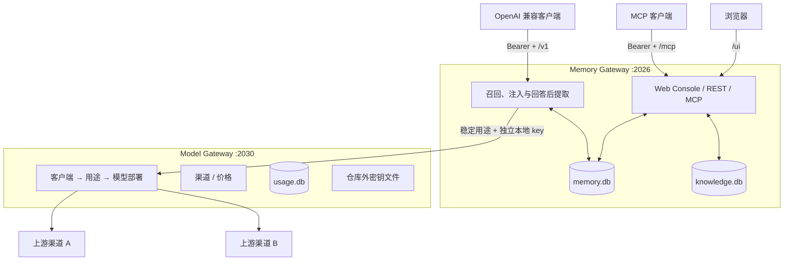

<div align="center">

# 🧠 Memory Platform

**让你的 AI 跨对话记住你。**

记忆保存在自己的设备上，随时可以查看、修改、删除和备份。<br>
兼容 OpenAI Chat Completions 与 MCP，不绑定某个模型或聊天客户端。

[](https://github.com/SparkHello/Memory_Platform/releases)
[](https://github.com/SparkHello/Memory_Platform/actions/workflows/ci.yml)
[](LICENSE)

**[中文](README.md)** · [English](README.en.md)

[🚀 开始使用](#-快速开始) · [✨ 1 分钟了解](#-1-分钟了解) · [🔌 接入现有客户端](#-客户端接入)

</div>


<p align="center"><sub>Local-first · Auditable · Model-neutral · 所有产品界面均为演示数据，不含真实用户内容</sub></p>

## ✨ 1 分钟了解

| 你可能先想知道 | 简短回答 |
| --- | --- |
| **它是做什么的？** | 运行在聊天客户端和模型之间，在需要时找回相关记忆，并在完整回答结束后保存值得长期保留的信息。 |
| **适合谁？** | 已在使用 Chatbox、RikkaHub、FLIT、OpenAI 兼容客户端或 MCP，希望 AI 记得个人偏好与长期项目的人。 |
| **需要准备什么？** | 一台自己的电脑、Docker Desktop（推荐）和一个模型渠道的 API Key。源码安装则需要 Python 3.12+、Node.js 22 与 npm。 |
| **数据保存在哪里？** | 记忆、知识文档和运行配置保存在本机；Docker 用户的数据位于本地 `memory-platform-data` 卷。 |
| **会绑定某个模型吗？** | 不会。客户端始终使用 `memory-auto`，以后更换渠道或模型只改服务端配置。 |
| **最快怎么开始？** | 启动 Docker → 浏览器里配置模型 → 在客户端填写 Base URL、API Key 和模型名三项。 |

Memory Platform 不是新的聊天客户端，也不自带大模型。语义搜索使用的 embedding 模型是可选项；不配置也可以先使用关键词检索。

> [!IMPORTANT]
> **“本地优先”不等于“永不联网”。** 记忆、知识文档和配置默认留在自己的设备上；如果使用云端模型渠道，你主动发送的当前消息，以及本轮允许使用的相关上下文，会发给该渠道完成推理。默认部署面向个人电脑或可信家庭网络，请不要把服务无鉴权暴露到公网。

## 🧭 选择你的使用方式

| 你的场景 | Memory Platform 如何处理 | 你得到什么 |
| --- | --- | --- |
| 用 Chatbox、RikkaHub、FLIT 等正常聊天 | 通过 OpenAI 兼容 `/v1` 自动召回，并在完整回答后提取记忆 | 不用改变聊天习惯，也不用每次重新介绍自己 |
| 希望模型主动查记忆或资料 | 通过 `/mcp` 提供记忆与知识库工具 | 模型只在需要时搜索、保存或整理 |
| 想知道 AI 记了什么 | 在 `/ui` 中展示来源、状态、召回原因和版本 | 可以搜索、修改、归档、恢复或彻底删除 |
| 经常更换模型或渠道 | 由 Model Gateway 按稳定用途路由到实际模型 | 客户端地址和记忆数据都不用跟着迁移 |

### 一个工作室看清上下文、记忆和关联主题


<p align="center"><sub>打开浏览器即可看到本轮上下文、长期核心记忆，以及“为什么这条记忆会被召回”。</sub></p>

## 🧠 对话如何成为长期记忆


目标是**少而可靠地记住**，而不是把每句话都塞进数据库。系统会等待完整回答结束，核对原话、主语、否定关系和敏感性，再决定是否保存；截断、内容过滤或未完成工具调用不会写入新记忆。

## 🖥️ 看得见，也管得住

以下界面均使用演示数据，不包含真实用户内容。原始产品截图未经生成或重绘，仅在详情示例中做了无损裁切；点击任意图片可查看原始尺寸。

### 搜索和治理整个记忆库


<p align="center"><sub>用搜索和筛选快速找到目标记忆，再进行固定、归档、恢复或批量治理。</sub></p>

### 核对一条记忆的来源与状态

<p align="center">
  
</p>

<p align="center"><sub>每条结论都能回到原始来源，并清楚显示状态、置信度和可执行的管理操作。</sub></p>

## 🚀 快速开始

### 最省事：使用 Docker

适合第一次体验。你需要先安装 Docker Desktop，并准备一个模型渠道的 API Key；不需要安装 Python、Node.js，也不需要先 clone 仓库。

```bash
curl -O https://raw.githubusercontent.com/SparkHello/Memory_Platform/main/deploy/docker-compose.user.yml
docker compose -f docker-compose.user.yml up -d
```

首次启动会自动初始化服务。运行下面的命令，并妥善保存输出中只显示一次的两把本地密钥：

```bash
docker compose -f docker-compose.user.yml logs memory-platform
```

- `GATEWAY_API_KEY`：登录 Web Console，以及连接聊天客户端和 MCP 时使用。
- Model Gateway admin key：只在浏览器里新增或修改模型渠道时使用。

这两把本地密钥都不是供应商 API Key；忘记后可以重新设置，不会从页面回显旧值。

接下来：

1. 打开 `http://127.0.0.1:2026/ui/`，在连接设置中填写 `GATEWAY_API_KEY`。
2. 进入「模型与路由」，用 admin key 解锁本次配置操作。
3. 点击「新建渠道」，选择预设、填写供应商 API Key，再从自动发现的列表中选择模型。
4. 按下方的[客户端接入](#-客户端接入)配置 Chatbox、RikkaHub、FLIT 等客户端。

所有运行数据都保存在 `memory-platform-data` Docker 卷中。升级镜像不会删除记忆；备份和迁移方法见[数据、备份与迁移](#-数据备份与迁移)。

### 从源码安装

适合 macOS/Linux，需要 Python 3.12+、Node.js 22 和 npm：

```bash
git clone https://github.com/SparkHello/Memory_Platform.git
cd Memory_Platform
scripts/setup.sh
```

安装脚本会准备环境、构建 Web Console、启动服务、生成本地密钥，并进入一次问完的模型配置向导。只准备环境、暂时不配置模型时使用 `scripts/setup.sh --install-only`；不需要 Web Console 时可以加 `--skip-ui`。

### 让 AI 帮你安装

也可以让 AI/Agent 按[这份安装指南](docs/ai-install.md)生成一份不含密钥的配置单，再调用 `scripts/setup.sh --config <文件> --json` 完成安装。供应商 API Key 只通过标准输入传给安装命令，不会写入配置单。

### 检查和日常运行

```bash
scripts/memgw stack status
scripts/memgw stack doctor

scripts/memgw stack start
scripts/memgw stack restart
scripts/memgw stack stop
```

Docker 用户直接使用完整的 Compose 命令：

```bash
docker compose -f docker-compose.user.yml ps
docker compose -f docker-compose.user.yml exec memory-platform memgw stack doctor

docker compose -f docker-compose.user.yml restart
docker compose -f docker-compose.user.yml stop
docker compose -f docker-compose.user.yml start
```

## 🔌 客户端接入

日常聊天推荐把 Memory Platform 当作一个 OpenAI 兼容服务。在 Chatbox、RikkaHub 等客户端中新建“OpenAI 兼容”提供方，填写：

```text
Base URL: http://127.0.0.1:2026/v1
API Key:  安装时生成的 GATEWAY_API_KEY
模型名:   memory-auto
```

发送一条完整消息后，可以打开 `http://127.0.0.1:2026/ui/` 查看是否产生了记忆。模型名始终填 `memory-auto`；以后更换供应商或模型，只改服务端配置，客户端不用跟着修改。

手机上的 `localhost` 和 `127.0.0.1` 指手机自己。局域网或 Tailscale 设备需要改用运行 Memory Platform 的电脑地址。具体填写位置、验证步骤和常见问题见[客户端接入指南](docs/client-setup.md)。

### MCP：让模型主动使用记忆和知识库

支持 Streamable HTTP MCP 的客户端可以连接：

```text
http://127.0.0.1:2026/mcp
```

鉴权使用同一个 `GATEWAY_API_KEY`。MCP 适合让模型主动搜索、保存或整理记忆，以及检索你明确导入的知识文档；普通聊天只配置上面的 OpenAI 兼容入口即可。

### 选择哪种接入方式

| 你想做什么 | 使用入口 | 谁决定何时使用记忆 |
| --- | --- | --- |
| 在普通聊天客户端里自动记住和召回 | `/v1` | Memory Platform 自动处理 |
| 让模型主动搜索、保存或整理记忆 | `/mcp` | 模型调用工具 |
| 查看、修改、删除、导入或备份 | `/ui` | 你在浏览器中操作 |
| 只使用统一模型路由 | Model Gateway `/v1` | 调用方选择用途 |

知识库不会因为使用聊天代理而自动进入上下文，需要通过 MCP、REST 或 Web Console 显式检索。

## 🧰 核心能力

### 长期记忆与治理

- 只从用户明确表达的内容中提取长期有用信息，并保存可核对的原文来源。
- 区分经历、事实、做事方式、情绪和反思，支持动态、已解决、归档、固定等生命周期。
- 提供衰减、激活、核心记忆、时间线、主题与实体关联，以及每次召回的解释。
- 支持编辑、合并、软删除、恢复、永久删除、导出、健康检查和召回评估。

### 自动记忆代理与 MCP

- 提供 `/v1/models` 和 `/v1/chat/completions`，兼容流式回答、工具调用、多模态消息段和推理字段。
- 默认在每轮聊天前召回，在完整最终回答后异步提取；截断、内容过滤或未完成工具调用不会写入记忆。
- 支持 `off`、`read`、`read-write` 三种记忆模式，并保留编辑消息或重新生成回答产生的会话分支。
- 通过 `/mcp` 提供显式的记忆、知识检索和文档管理工具。

### 独立知识库

- 支持文本、Markdown、PDF、DOCX 和 EPUB。
- 记忆与知识文档分别存储，避免长文进入记忆衰减、浮现或自动聊天上下文。
- 支持全文与向量混合检索、不可变文档版本和精确片段引用。
- 知识代理只编排本地索引并选择引用，不执行文档中的指令。

### 模型、故障切换与用量

- 按聊天、记忆提取、知识检索等用途选择模型，具体供应商变化时客户端无需修改。
- 每种用途可以设置备用模型；流式回答开始后不会把另一家响应拼接到中途。
- 记录实际使用的渠道、模型、Token、耗时和价格快照，不记录 Prompt、回复、工具参数或知识正文。
- embedding 路由强制使用一致的向量空间和维度，配置不匹配时安全回退关键词检索。

完整接口和行为契约见 [Memory Gateway](services/memory-gateway/README.md) 与 [Model Gateway](services/model-gateway/README.md) 文档。

## 🧱 技术设计

### 为什么是两个网关

记忆逻辑与模型供应商配置的变化速度、安全职责不同。Memory Platform 因此把它们分开运行，但统一安装、测试、备份和迁移：

| 服务 | 默认地址 | 负责 | 不负责 |
| --- | --- | --- | --- |
| [Memory Gateway](services/memory-gateway/README.md) | `127.0.0.1:2026` | 长期记忆、近期上下文、知识库、MCP、OpenAI 兼容代理和 Web Console | 管理供应商账号和渠道价格 |
| [Model Gateway](services/model-gateway/README.md) | `127.0.0.1:2030` | 模型连接、用途路由、备用顺序、密钥引用、用量和价格快照 | 保存聊天、记忆或知识正文 |

源码和版本统一管理；运行配置、API Key、SQLite 数据、日志和评测快照仍保存在仓库外或被 Git 忽略。合并仓库不等于合并敏感数据边界。

### 架构与数据流



一次 `/v1/chat/completions` 请求大致经历：

1. Memory Gateway 根据最后一条用户消息和可见历史识别当前会话分支。
2. 在超时预算内召回长期记忆；embedding 不可用时回退关键词检索。
3. 过滤 private/sensitive 内容，并在字符预算内把记忆插入初始 system 区域。
4. 使用稳定的 `memory.chat` route 调用 Model Gateway，由后者选择实际渠道和模型。
5. 原始 JSON 或 SSE 字节透明转发给客户端。
6. 只有收到完整最终文本、没有未完成工具调用且不是截断或内容过滤时，才激活旧记忆、保存分支并提取新记忆。

### 进阶模型配置

源码安装会在 `scripts/setup.sh` 中进入模型 quickstart；之后也可以单独运行：

```bash
services/memory-gateway/.venv/bin/modelgw quickstart
```

quickstart 内置 DeepSeek、Kimi 中国区、MiMo 和 DashScope 北京区预设，只询问渠道、API Key、聊天模型，以及是否配置可选的语义搜索。它会只读请求 `/models` 展示当前 key 可见的精确模型 ID，不会自动发送推理。

几个进阶概念：

| 页面名称 | 技术名称 | 含义 |
| --- | --- | --- |
| 渠道 | connection | 实际购买 API、持有账号和密钥的服务商 |
| 模型 | deployment | 该渠道上的精确模型 ID 与能力声明 |
| 用途 | route | 聊天、记忆提取、知识检索等稳定业务名称 |
| 优先顺序 | fallback | 当前模型不可用时依次尝试的备用模型 |
| 价格 | pricing | 与具体模型绑定、经人工核对的价格快照 |

已有环境只重新配置时使用 `scripts/setup.sh --configure-only --config <文件> --json`。已有多渠道备用顺序或精细用途配置时，不要用 quickstart 覆盖，改用 `modelgw` 的独立子命令；详见 [Model Gateway README](services/model-gateway/README.md)。

### 常用地址

| 用途 | URL |
| --- | --- |
| Web Console | `http://127.0.0.1:2026/ui/` |
| 健康检查 | `http://127.0.0.1:2026/health` |
| MCP | `http://127.0.0.1:2026/mcp` |
| OpenAI 兼容 Memory base URL | `http://127.0.0.1:2026/v1` |
| Model Gateway base URL | `http://127.0.0.1:2030/v1` |

## 🔐 配置与安全边界

### 密钥和身份

系统中存在几类用途不同的密钥，不应复用：

| 密钥 | 用途 | 保存位置 |
| --- | --- | --- |
| Memory Gateway API key | 客户端访问 `/v1`、MCP、REST 和 Web Console API | Memory Gateway 用户配置目录 |
| Model Gateway backend key | Memory Gateway 调用允许的 `memory.*`、`knowledge.*` route | 两端各自的仓库外密钥文件 |
| Model Gateway admin key | 修改渠道密钥和 route 配置 | 仅管理端临时使用，不由 Memory Gateway 持久化 |
| Provider API key | 调用真实上游渠道 | Model Gateway 仓库外 `secrets.env` |

`GATEWAY_API_KEY` 默认绑定固定的 `GATEWAY_USER_ID`，调用方不能通过 `X-User-Id` 改写命名空间。`GATEWAY_ALLOW_USER_ID_HEADER=true` 仅用于旧版共享 key 迁移，不建议用于不可信网络。

### 敏感数据出站

- `ALLOW_SENSITIVE_EGRESS=false` 默认阻止本地识别为 private/sensitive 的内容进入远程记忆提取、embedding、AI 体检和知识代理。
- 该开关不拦截用户主动通过 `/v1` 发送给聊天上游的当前消息。
- `redact_sensitive=true` 只遮罩本次响应，不会改写 SQLite 原文，也不会让备份自动脱敏。
- 记忆与知识 embedding 必须携带可信且一致的空间 ID；缺失或不匹配时回退关键词/FTS，不猜测旧向量属于当前空间。

### 部署边界

当前默认目标是个人、本机或可信家庭网络：

- SQLite、缓存、工具幂等和部分后台状态按单进程设计；
- 不应把默认部署直接当成公开互联网多租户 SaaS；
- Model Gateway 管理接口默认只监听回环地址；跨主机暴露必须置于 HTTPS 后；
- 需要强隔离时，应为不同用户使用不同凭证和实例，而不是启用共享 key 的可变 `X-User-Id`。

完整安全说明见 [Memory Gateway 安全边界](services/memory-gateway/README.md#安全边界)和 [Model Gateway 核心边界](services/model-gateway/AGENTS.md#核心边界)。

## 💾 数据、备份与迁移

### 数据在哪里

仓库只保存源代码和非敏感示例。实际运行数据位于用户配置目录，主要包括：

- 长期记忆、近期上下文和分支节点；
- 独立知识库和文档版本；
- Model Gateway 配置、用量库和价格快照；
- 两个服务各自的密钥文件和日志。

不要把 `.env`、真实 SQLite、日志、评测快照或便携备份提交到 Git。

### 便携备份

```bash
scripts/memgw stack backup --output memory-stack.zip
```

只下载了 `docker-compose.user.yml` 的 Docker 用户可以直接在容器内备份，再复制到当前目录：

```bash
docker compose -f docker-compose.user.yml exec memory-platform \
  memgw stack backup --output /data/memory-stack.zip
docker compose -f docker-compose.user.yml cp \
  memory-platform:/data/memory-stack.zip ./memory-stack.zip
```

备份包含允许迁移的记忆库、知识库、Model Gateway 脱敏配置、用量库和非密钥设置，但不包含 provider key、admin key、backend key 或 Memory Gateway API key。

备份虽然不含密钥，仍包含完整私人记忆和知识正文，必须按敏感文件保管。

恢复到新设备：

```bash
git clone <your-repository-url> Memory_Platform
cd Memory_Platform
scripts/bootstrap.sh
scripts/memgw stack restore /path/to/memory-stack.zip --yes --start
```

恢复前会校验清单哈希、SQLite 和 JSON，停止两个服务，并为被替换的本机文件创建仓库外回滚副本。恢复后需要重新输入未进入备份的各类密钥。

### 从旧版 `My_Memory` + `Model_Gateway` 双目录迁移

如果旧设备仍保留两个独立项目，优先使用旧 `My_Memory` 中已经提供的统一栈备份，而不是手工复制 `.env` 或数据库：

```bash
cd /path/to/My_Memory
scripts/memgw stack backup --output /safe/path/memory-stack.zip

cd /path/to/Memory_Platform
scripts/bootstrap.sh
scripts/memgw stack restore /safe/path/memory-stack.zip --yes --start
```

迁移后：

- 旧 `My_Memory` 对应 `services/memory-gateway`；
- 旧 `Model_Gateway` 对应 `services/model-gateway`；
- 两个服务不再各自维护 Git 历史，统一从仓库根目录提交；
- 旧目录可以暂时保留作只读回滚来源，不要让新旧两套服务同时占用相同端口或写同一数据库；
- 确认新栈、Web Console、记忆数量和知识文档正常后，再自行决定是否归档旧目录。

## 🔁 兼容 direct-provider 模式

如果暂时不运行独立 Model Gateway，Memory Gateway 仍保留旧的 `UPSTREAM_*`、`LLM_*`、`memgw model`、`memgw route` 和 `memgw pricing` 兼容路径。

新部署推荐使用 Model Gateway。只要 `MODEL_GATEWAY_BASE_URL` 与 `MODEL_GATEWAY_API_KEY` 成对配置，聊天、后台记忆任务、知识代理和 embedding 就只调用稳定 route，不会在中央路由失败时偷偷回退到旧 `.env` provider key。

兼容模式的完整环境变量见 [Memory Gateway 配置项](services/memory-gateway/README.md#配置项)。

## 📁 仓库结构

```text
Memory_Platform/
├── services/
│   ├── memory-gateway/       长期记忆、知识库、MCP、/v1 代理与 Web Console
│   │   ├── app/              FastAPI、记忆、知识、LLM、MCP、用量与 CLI
│   │   ├── ui/               React / TypeScript / Vite 控制台
│   │   ├── tests/            Memory Gateway 测试
│   │   └── docs/             接入、算法与产品文档
│   └── model-gateway/        模型连接、deployment、route、pricing 与 usage
│       ├── model_gateway/    服务、透明代理、路由、配置、管理接口与 CLI
│       ├── tests/            Model Gateway 测试
│       └── docs/             配置、协议、运行与 LiteLLM 评估
├── scripts/
│   ├── bootstrap.sh          创建统一开发环境并构建前端
│   ├── memgw                 双服务统一入口
│   └── test.sh               两个后端测试集和前端生产构建
├── deploy/                   Docker 入口脚本与用户/开发 compose 文件
├── Dockerfile                单容器双服务一体化镜像（含 UI 构建）
├── docs/reviews/             跨服务评测与审计报告
├── AGENTS.md                 仓库开发和安全边界
└── README.md
```

两个服务共享 Git 历史，但继续使用各自的运行配置、进程和数据库。不要在 `services/` 下再次执行 `git init`。

## 🔧 开发与验证

安装开发环境：

```bash
scripts/bootstrap.sh
```

运行完整门禁：

```bash
scripts/test.sh
```

该命令依次执行：

1. Memory Gateway pytest；
2. Model Gateway pytest；
3. Web Console TypeScript 检查和 Vite 生产构建。

定向测试示例：

```bash
cd services/memory-gateway
.venv/bin/python -m pytest tests/test_chat_gateway.py

cd ../model-gateway
../memory-gateway/.venv/bin/python -m pytest tests/test_service.py
```

仅修改前端时至少运行：

```bash
cd services/memory-gateway/ui
npm run build
```

测试必须使用 fake provider、`httpx.MockTransport` 和临时目录，不得调用真实供应商或修改真实 `memory.db`、`knowledge.db` 和用户配置目录。更详细的开发边界见根 [AGENTS.md](AGENTS.md) 及两个服务自己的 `AGENTS.md`。

## 🎯 当前范围

Memory Platform 当前适合：

- 个人 AI 助手和本地可信网络；
- 需要可审计、可编辑、可删除记忆的聊天客户端；
- 希望同时支持 OpenAI-compatible 与 MCP 的本地记忆基础设施；
- 对敏感内容出站、模型渠道归因和向量空间一致性有明确要求的知识工作台。

当前不以这些场景为目标：

- 未经额外加固的公网多租户 SaaS；
- 百万级记忆的低延迟 ANN 检索；
- 强一致、跨进程共享的任务队列和缓存；
- 完整实体消歧、双时态和深层多跳推理知识图谱；
- OpenAI Responses、音频、文件、图片生成等完整 API 代理。

架构、真实体验、横向对照和后续路线见 [Memory Platform 深度评测](docs/reviews/JJC-20260805-002-memory-platform-deep-review.md)。

## 📚 进一步阅读

- [贡献指南](CONTRIBUTING.md)
- [安全策略](SECURITY.md)
- [变更记录](CHANGELOG.md)
- [客户端接入指南（Chatbox / RikkaHub 等）](docs/client-setup.md)
- [Memory Gateway 完整说明](services/memory-gateway/README.md)
- [Model Gateway 完整说明](services/model-gateway/README.md)
- [客户端接入](services/memory-gateway/docs/client_integration.md)
- [Model Gateway 配置标准](services/model-gateway/docs/configuration.md)
- [Model Gateway 客户端协议](services/model-gateway/docs/client-protocol.md)
- [运行、后台服务与健康检查](services/model-gateway/docs/operations.md)
- [Memory Platform 深度评测](docs/reviews/JJC-20260805-002-memory-platform-deep-review.md)

## 📄 开源许可证

本项目采用 [Apache License 2.0](LICENSE)。该许可证包含显式的专利授权，同时要求保留版权声明并标注对文件的修改。

使用、修改或再分发本项目时，请保留 `LICENSE` 文件与版权声明。
