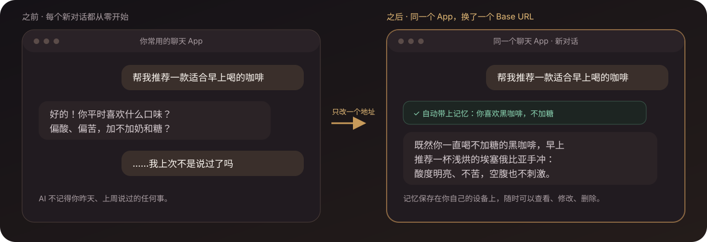

<div align="center">

# 🧠 Memory Platform

**让你正在用的 AI 聊天 App 记住你。换个窗口、换个模型，它还记得。**

装在自己手机或电脑上的一层「记忆中转站」：聊天 App 只需把接口地址改成它，<br>
每次对话它会自动带上相关的记忆，聊完再把值得记住的事保存下来。不用装插件，也不用反复说「记住这件事」。

[](https://github.com/SparkHello/Memory_Platform/releases)
[](https://github.com/SparkHello/Memory_Platform/actions/workflows/ci.yml)
[](LICENSE)

**[中文](README.md)** · [English](README.en.md)

<br>

[<kbd>&nbsp;📱 &nbsp;手机上用：安卓 App&nbsp;</kbd>](#-手机上用安卓-app) &nbsp;&nbsp; [<kbd>&nbsp;💻 &nbsp;电脑上用：Docker 一键安装&nbsp;</kbd>](#-电脑上用docker-一键安装)

<sub>[🔌 聊天 App 怎么填](#-聊天-app-怎么填) · [🔑 三把钥匙](#-三把钥匙) · [🖥️ 看得见管得住](#️-看得见也管得住) · [🔬 进一步了解](#-进一步了解) · [📚 文档](#-文档)</sub>

</div>



<p align="center"><sub>示意图。记忆保存在你自己的设备上，随时可以查看、修改、删除、备份。</sub></p>

## ✨ 它解决什么问题

AI 聊天 App 每开一个新窗口就把你忘光：昨天说过的偏好、正在做的项目、家里人的名字，都要重新交代。Memory Platform 站在聊天 App 和模型之间，把这件事自动做掉：

| 你想知道 | 简短回答 |
| --- | --- |
| **要换聊天 App 吗？** | 不用。Chatbox、RikkaHub、FLIT 等任何能填「OpenAI 兼容」地址的 App 都行，只改地址、密钥、模型名三项。 |
| **要我自己说「记住」吗？** | 不用。它等 AI 完整回答后，自己判断这一轮有没有值得长期记住的事；密码、证件号这类除非你明确要求，否则永不保存。 |
| **记忆存在哪？** | 你自己的手机或电脑上（SQLite 文件）。可以在本地网页控制台里搜索、修改、删除、导出。 |
| **换模型要重来吗？** | 不用。聊天 App 里模型名永远填 `memory-auto`，用哪家模型在控制台里改。 |
| **需要什么？** | 一部安卓手机，或一台装了 Docker 的电脑；再加一个模型渠道的 API Key（DeepSeek、阿里云百炼等，向导里有领取链接）。 |

> [!IMPORTANT]
> **「本地」不等于「不联网」。** 记忆、文档和配置留在你的设备上；但你发出的当前消息，以及这一轮允许使用的相关记忆，会发给你选的模型渠道去生成回答。默认只服务本机或可信家庭网络，不要把它无鉴权地暴露到公网。

## 🚀 快速开始

### 📱 手机上用：安卓 App

用得最多、门槛最低的方式。整套服务装进一个 App，在手机后台常驻，手机上的聊天 App 直接连它。不需要电脑。

1. 到 [Releases](https://github.com/SparkHello/Memory_Platform/releases) 下载 `memory-platform-android-*.apk`（arm64，Android 8.0+），安装时允许「未知来源」。
2. 打开 App，点「启动服务」，允许通知。状态页是一张四步清单，做完一步自动打勾。
3. 点「打开控制台配置模型」。浏览器会**自动登录**（不用复制粘贴任何密钥），选一个渠道、粘贴该渠道的 API Key、选一个聊天模型，保存。
4. 回到 App，点「打开控制台创建聊天密钥」，在「客户端接入」创建一把聊天密钥。
5. 在手机聊天 App 里新建「OpenAI 兼容」供应商：地址填 `http://127.0.0.1:2026/v1`，API Key 填刚创建的聊天密钥，模型名填 `memory-auto`。地址和模型名在 App 状态页有「复制」按钮。
6. 状态页若出现红框「后台可能被系统限制」，点「去关闭电池优化」。小米、华为、OPPO、vivo 等系统还要在系统设置里允许自启动、把省电策略设为无限制，并在最近任务里锁定，否则后台会被杀，记忆会悄悄丢失。

做完后控制台工作台会出现「试一下」卡：照着发一句测试语，卡片会实时显示第一条记忆有没有存下来。出问题时 App「高级」里的「导出诊断包」会打包日志、脱敏配置和记忆库快照。

技术上它用 Chaquopy 内嵌 Python 3.14 运行同一份服务端代码，SQLite 自带 FTS5，只监听 `127.0.0.1`。构建方法、已知限制和排障见[安卓客户端方案](docs/android.md)。

### 💻 电脑上用：Docker 一键安装

只需要 Docker Desktop 和一个模型渠道的 API Key；不需要安装 Python、Node.js，也不需要 clone 仓库。

macOS / Linux 终端（版本号固定到要安装的 release）：

```bash
VERSION=v0.5.1
curl -fsSL "https://raw.githubusercontent.com/SparkHello/Memory_Platform/$VERSION/deploy/install.sh" -o install-memory-platform.sh
MEMORY_PLATFORM_VERSION="$VERSION" sh install-memory-platform.sh
```

Windows PowerShell 5.1+（同样固定到明确的 release）：

```powershell
$Version = "v0.5.1"
irm "https://raw.githubusercontent.com/SparkHello/Memory_Platform/$Version/deploy/install.ps1" -OutFile install-memory-platform.ps1
$env:MEMORY_PLATFORM_VERSION = $Version
powershell.exe -NoProfile -ExecutionPolicy Bypass -File .\install-memory-platform.ps1
```

Windows 安装器目前仍标记为实验性；正式数据请先阅读[栈运维指南](docs/stack-operations.md)，并额外保留一份手动备份。

安装完成后，安装目录 `credentials/` 下有两个密钥文件，接着三步：

1. 打开 `http://127.0.0.1:2026/ui/`，粘贴 `credentials/gateway.txt` 里的**登录密钥**登录（旧版叫 `gateway.key`）。
2. 进「模型与路由」，粘贴 `credentials/admin.txt` 里的**管理密钥**，新建渠道、粘贴供应商 API Key、选模型。
3. 在「客户端接入」创建一把**聊天密钥**，按下面[聊天 App 怎么填](#-聊天-app-怎么填)填进聊天 App。

首次启动需要 1–2 分钟。配置模型之前 `/health` 为 200、`/readyz` 为 503 是正常的：前者保证设置页面能打开，后者才表示可以聊天。密钥值不会进入环境变量、命令参数或 Docker 日志，只写入 `credentials/` 下的 `0600` 文件。

卸载见[栈运维指南 · 卸载 Docker 安装](docs/stack-operations.md#卸载-docker-安装)。不要用 `docker system prune`。

<details>
<summary>国内网络、安装器细节、手工 Compose、源码安装</summary>

**国内网络**：直连 GHCR 或 GitHub 受阻时，脚本下载失败可先设代理（`HTTPS_PROXY=http://127.0.0.1:7890`）重跑；镜像拉取失败可设 `MEMORY_IMAGE_REGISTRY=<GHCR 镜像站域名>` 覆盖镜像源（只替换 registry 主机，仓库路径与 digest 固定不变）。

**安装器做了什么**：下载固定 release → 把三枚镜像解析为不可变 digest → 旧栈停写后创建并复验一致性备份（每次升级一份）→ 离线初始化或升级 → 启动独立的 Memory/Model 容器。重复运行时，digest、受管配置和健康状态都一致会走 `noop`；只有服务退化时走不备份、不停整栈的定向 `repair`；镜像或受管配置变化才进入带一致性备份与回滚 journal 的 `upgrade`。升级前会记录旧 Memory/Model 的实际 readiness 基线，无法确定时在停机前失败，候选验收不得低于该基线；全新安装只要求 `/health`。升级时显式把 `VERSION` 改为目标 release。默认目录是 `~/memory-platform`。镜像签名验证默认跳过（镜像已按 digest 固定）；需要时设 `MEMORY_VERIFY_SIGNATURES=1` 启用 Sigstore 验签。旧单卷（legacy all-in-one）布局不再由安装器内嵌迁移：先运行同一 release 的一次性迁移工具（`curl -fsSL "https://raw.githubusercontent.com/SparkHello/Memory_Platform/$VERSION/deploy/legacy_cutover.py" -o legacy-cutover.py && python3 legacy-cutover.py`），完成旧单卷到四卷的迁移后再重跑安装命令。

**手工 Compose（想自己控制每一步）**：

```bash
VERSION=v0.5.1
curl -O "https://raw.githubusercontent.com/SparkHello/Memory_Platform/$VERSION/deploy/docker-compose.user.yml"
mkdir -m 700 credentials
printf 'HOST_UID=%s\nHOST_GID=%s\n' "$(id -u)" "$(id -g)" > .env
docker compose -f docker-compose.user.yml up -d
```

Compose 拉取同一 semver 的 `memory-platform-memory`、`memory-platform-model` 和 `memory-platform-init` 镜像；正式安装器还会把 tag 固定成实际 digest。三枚镜像使用同一份哈希校验的依赖制品集合构建，但不共享完整 Python 环境：Memory 长期镜像只安装 Memory、Web UI、窄协议包及自身依赖，Model 长期镜像只安装 Model、窄协议包及自身依赖；只有离线 init/maintenance 镜像同时包含两侧维护工具。就绪后 `cat credentials/gateway.txt`、`cat credentials/admin.txt` 查看两把密钥。全新安装时登录密钥是仅有 Console scope 的 `first-console` token；旧卷迁移时才保留一个版本的 legacy all-scope key。端口 2026 被占用时，在 `.env` 增加 `MEMORY_PORT=3026` 后重启即可。镜像升级不会删除四个私有卷中的数据。

**从源码安装**（macOS/Linux，需要 Python 3.12+、Node.js 22 和 npm）：

```bash
git clone https://github.com/SparkHello/Memory_Platform.git
cd Memory_Platform
scripts/setup.sh
```

安装脚本会准备环境、构建 Web Console、启动服务、生成本地密钥，并进入模型配置向导。只准备环境用 `scripts/setup.sh --install-only`；不需要 Web Console 加 `--skip-ui`。也可以让 AI/Agent 按[AI 安装指南](docs/ai-install.md)生成不含密钥的配置单，再调用 `scripts/setup.sh --config <文件> --json` 完成安装。供应商 API Key 只通过标准输入传给安装命令。

</details>

## 🔌 聊天 App 怎么填

在 Chatbox、RikkaHub、FLIT 等 App 里新建一个「OpenAI 兼容」供应商，填三项：

```text
Base URL: http://127.0.0.1:2026/v1
API Key:  在控制台「客户端接入」为这台设备创建的聊天密钥
模型名:   memory-auto
```

然后发一句带个人偏好的话，比如「我喜欢黑咖啡，不加糖，以后推荐咖啡时记住这一点」，等 AI 完整回答结束。打开控制台就能看到这条记忆；新开一个对话问「我喜欢什么咖啡」，它应该能答上来。

- **手机上的 `127.0.0.1` 指手机自己**。装了安卓 App 时这正是要填的地址；要连电脑上的服务，改成电脑的局域网地址，Docker 部署还需先在 Compose 同目录 `.env` 加一行 `MEMORY_HOST=0.0.0.0` 并重启。
- **不想留下记忆的对话**，把模型名换成 `memory-read`（只用已有记忆、不写新的）或 `memory-off`（完全不碰记忆）即可，不需要客户端支持自定义请求头。
- **以后换模型渠道**，只在控制台改，聊天 App 不用动。

具体每个 App 的填写位置、验证步骤和常见问题见[客户端接入指南](docs/client-setup.md)。

## 🔑 三把钥匙

全程只有三把钥匙，各管一件事，不要混用：

| 钥匙 | 在哪 | 干什么 | 安卓 App |
| --- | --- | --- | --- |
| **登录密钥** | `credentials/gateway.txt`（旧版 `gateway.key`） | 登录网页控制台 | 点「打开控制台」自动带上 |
| **管理密钥** | `credentials/admin.txt`（旧版 `admin.key`） | 在「模型与路由」页改模型渠道 | 点「打开控制台」自动带上 |
| **聊天密钥** | 控制台「客户端接入」创建，只显示一次 | 填进聊天 App 的 API Key | 控制台里创建后复制 |

每台聊天 App 用自己的聊天密钥，哪台设备丢了就只撤销哪一把。支持 MCP 的客户端另有独立的 MCP 密钥。供应商的 API Key 只存在服务端，永远不会发给聊天 App。

## 🖥️ 看得见，也管得住

### 一个工作室看清上下文、记忆和关联主题


<p align="center"><sub>打开浏览器即可看到本轮上下文、长期核心记忆，以及“为什么这条记忆会被召回”。</sub></p>

### 对话如何成为长期记忆


系统等待完整回答结束，核对原话、主语、否定关系和敏感性，再决定是否保存。截断、内容过滤或未完成工具调用不会写入新记忆；只有寒暄致谢、纯提问或纯代码的轮次会被本地预过滤跳过，不调用提取模型。

用户不需要逐条补充“请记住”之类的提示；系统只从用户实际表达过的内容中保守提取值得长期保留的信息。健康、住址、联系方式、收入等私密事实也会自动保存，并只在与当前问题明确相关时才注入聊天；密码、证件号、银行卡/账号等敏感信息仍需用户明确要求记住，且永不注入聊天。

敏感过滤按句子进行：默认（`ALLOW_SENSITIVE_EGRESS=false`）只有含密码、证件号、账号的句子不会发给提取模型，同一轮的其余句子照常提取；这类句子若紧邻“记住”，会不经模型直接原句保存在本地。

### 搜索和治理整个记忆库


<p align="center"><sub>所有界面均使用演示数据。搜索、筛选、固定、归档、恢复和永久删除都在本地 Web Console 中完成。</sub></p>

## 🔬 进一步了解

### 两层网关，普通聊天自动工作


客户端只需要连接 Memory Gateway。普通 `/v1` 请求的记忆召回、上下文注入和回答后提取都由网关自动完成，不依赖模型是否记得调用工具。Model Gateway 在后方按稳定用途选择渠道、模型和备用顺序；需要显式搜索、整理记忆或检索知识库时，再按需使用 `/mcp`。

| 你想做什么 | 使用入口 | 谁决定何时使用记忆 |
| --- | --- | --- |
| 在普通聊天客户端里自动记住和召回 | `/v1` | Memory Platform 自动处理 |
| 让模型主动搜索、保存或整理记忆 | `/mcp` | 模型调用工具 |
| 查看、修改、删除、导入或备份 | `/ui` | 你在浏览器中操作 |
| 只使用统一模型路由 | Model Gateway `/v1` | 调用方选择用途 |

支持 Streamable HTTP MCP 的客户端可以连接 `http://127.0.0.1:2026/mcp`，鉴权使用为该客户端单独创建的 MCP 密钥。MCP 适合让模型显式搜索、保存或整理记忆，以及检索你明确导入的知识文档；它是增强入口，不是自动记忆的前提。知识库不会因为使用聊天代理而自动进入上下文，需要通过 MCP、REST 或 Web Console 显式检索。

### 为什么选择 Memory Platform

- **网关自动记忆，而不是等待模型调用工具**：普通 OpenAI-compatible 聊天自动召回、注入和保存；MCP 与额外记忆提示词都不是前提。
- **接入现有客户端，而不是重做聊天入口**：只需替换 Base URL、API Key 和模型名，继续使用熟悉的聊天客户端。
- **治理先于“记得更多”**：每条记忆保留来源和状态，可解释为什么被召回，也可以编辑、归档、恢复或彻底删除。
- **记忆和知识物理分开**：个人事实与长期偏好进入 `memory.db`；导入的长文档进入独立的 `knowledge.db`，不会混入记忆衰减或自动聊天上下文。
- **模型选择留在服务端**：Model Gateway 按稳定用途选择渠道、模型和备用顺序，客户端与记忆数据不用跟着供应商迁移。

常见项目解决的不是同一层问题，按你的首要目标选择即可：

| 你的首要目标 | 更适合先看 |
| --- | --- |
| 给自研应用接入通用记忆 SDK、服务端 API 或托管平台 | [Mem0](https://github.com/mem0ai/mem0) |
| 构建强调实体关系、事实有效期和历史查询的时态上下文图 | [Zep / Graphiti](https://github.com/getzep/graphiti) |
| 构建由 agent 自主管理状态、记忆和工具的有状态 agent runtime | [Letta](https://github.com/letta-ai/letta) |
| 继续使用现有 OpenAI 兼容客户端，同时获得网关自动记忆、本地部署、可审计治理、独立知识库和统一模型路由 | **Memory Platform** |

这不是性能排名。Memory Platform 当前更偏个人、本机或可信家庭网络；它不试图替代托管记忆平台、完整时态知识图谱或 agent runtime。

### 核心能力

- **自动记忆网关与可选 MCP**：普通 `/v1` 聊天自动召回、注入和保存；兼容流式回答、工具调用、多模态消息段和推理字段，并支持 `off`、`read`、`read-write` 三种记忆模式和会话分支。
- **长期记忆与治理**：保存可核对的原文来源，支持生命周期、时间线、主题关联、召回解释、编辑、合并、软删除、恢复、永久删除和导出。
- **独立知识库**：支持文本、Markdown、PDF、DOCX 和 EPUB，提供全文与向量混合检索、不可变文档版本和精确片段引用。
- **模型、故障切换与用量**：按用途选择模型和备用顺序，记录渠道、模型、Token、耗时和价格快照，但不记录 Prompt、回复、工具参数或知识正文。
- **可选且严格的向量能力**：`memory.embedding` route 缺失或关闭时使用关键词检索；启用即表示选择语义向量，空白 space 配置会自动采用 route 契约，畸形、不可用或与显式固定值不匹配时 `/readyz` 报错，绝不混用旧空间。密码、证件号、账号等敏感句子默认不进入远程记忆提取和 embedding（按句过滤，其余内容照常出站）；健康、住址、联系方式、收入等私密内容的出站上限由 `MEMORY_EGRESS_CEILING` 控制；上下文压缩、AI 体检和知识代理仍对所有非普通级别内容默认不出站。

完整接口和行为契约见 [Memory Gateway](services/memory-gateway/README.md) 与 [Model Gateway](services/model-gateway/README.md)。

### 两个网关，一套安装

| 服务 | 默认地址 | 负责 | 不负责 |
| --- | --- | --- | --- |
| [Memory Gateway](services/memory-gateway/README.md) | `127.0.0.1:2026` | 长期记忆、近期上下文、知识库、MCP、OpenAI 兼容代理和 Web Console | 管理供应商账号和渠道价格 |
| [Model Gateway](services/model-gateway/README.md) | Docker 私有网络 `model-gateway:2030`（不发布宿主端口） | 模型连接、用途路由、备用顺序、密钥引用、用量和价格快照 | 保存聊天、记忆或知识正文 |

记忆行为与模型供应商配置的变化速度、安全职责不同，因此分别运行；安装、测试、备份和迁移仍由仓库根命令统一完成。Memory Gateway 只通过稳定 route 和独立 backend key 调用 Model Gateway。

### 当前边界

- 默认目标是个人电脑或可信家庭网络，不是未经加固的公网多租户 SaaS。
- SQLite、缓存、工具幂等和部分后台状态按单进程设计，不以百万级记忆的低延迟 ANN 检索为目标。
- 当前提供轻量主题、实体和时态关联，不等同于完整实体消歧、双时态知识图谱或深层多跳推理。
- 当前 OpenAI 兼容入口聚焦 Chat Completions，不是 Responses、音频、文件或图片生成的完整 API 代理。
- 备份不含密钥，但包含完整私人记忆和知识正文，仍应按敏感文件保管。
- 安卓版只提供 arm64 包，面向单机自用；受系统后台策略影响，需要按说明关闭电池优化并允许自启动。

密钥边界、敏感数据出站、备份恢复和高级模型配置见[栈运维指南](docs/stack-operations.md)。

## 📚 文档

- [客户端接入指南（Chatbox / RikkaHub / FLIT 等）](docs/client-setup.md)
- [安卓客户端方案：安装、构建与排障](docs/android.md)
- [栈运维、高级配置、备份与迁移](docs/stack-operations.md)
- [让 AI 帮你安装](docs/ai-install.md)
- [兼容契约与持久化版本](docs/compatibility-contract-v2.md)
- [Memory Gateway 完整说明](services/memory-gateway/README.md)
- [Model Gateway 完整说明](services/model-gateway/README.md)
- [贡献指南](CONTRIBUTING.md)
- [安全策略](SECURITY.md)
- [变更记录](CHANGELOG.md)

## 📄 开源许可证

本项目采用 [Apache License 2.0](LICENSE)。使用、修改或再分发时，请保留许可证文件与版权声明。
