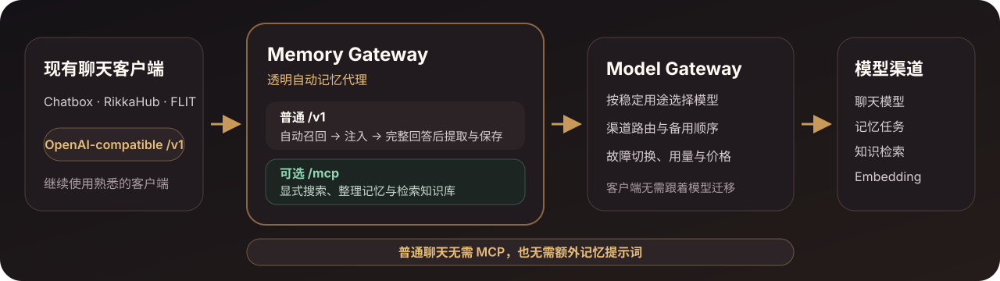
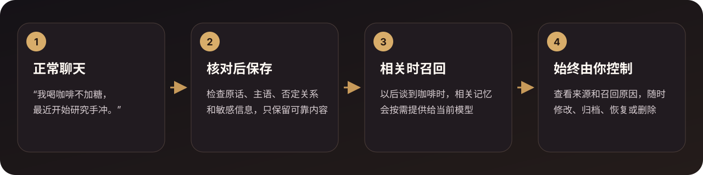

<div align="center">

# 🧠 Memory Platform

**给现有 AI 客户端加上一层会自动记忆的本地网关。**

普通聊天只需接入 OpenAI-compatible `/v1`：Memory Platform 自动召回相关记忆、注入上下文，并在完整回答后提取值得长期保存的信息。<br>
**无需配置 MCP，也无需额外提示 AI“记住这件事”。** MCP 是可选入口，用于显式搜索、整理记忆和检索知识库。

记忆保存在自己的设备上，随时可以查看、修改、删除和备份；模型渠道、路由和故障切换统一由服务端管理。

[](https://github.com/SparkHello/Memory_Platform/releases)
[](https://github.com/SparkHello/Memory_Platform/actions/workflows/ci.yml)
[](LICENSE)

**[中文](README.md)** · [English](README.en.md)

[🔀 工作原理](#-两层网关普通聊天自动工作) · [🧭 为什么选择](#-为什么选择-memory-platform) · [🚀 开始使用](#-快速开始) · [🔌 接入客户端](#-客户端接入) · [📚 文档](#-文档)

</div>


<p align="center"><sub>Automatic memory gateway · Local-first · Auditable · Model-neutral · 所有产品界面均为演示数据，不含真实用户内容</sub></p>

## ✨ 1 分钟了解

| 你可能先想知道 | 简短回答 |
| --- | --- |
| **它是做什么的？** | 一个运行在聊天客户端和模型之间的自动记忆网关：需要时召回并注入相关记忆，完整回答结束后提取值得长期保留的信息。 |
| **适合谁？** | 已在使用 Chatbox、RikkaHub、FLIT 或其他 OpenAI 兼容客户端，希望 AI 记得个人偏好与长期项目的人。 |
| **数据保存在哪里？** | 记忆、知识文档和运行配置保存在本机；Docker 用户的数据位于本地 `memory-platform-data` 卷。 |
| **需要更换客户端吗？** | 不需要。把现有客户端的 Base URL 指向 Memory Platform 的 OpenAI 兼容 `/v1` 即可。 |
| **需要 MCP 或记忆提示词吗？** | 普通聊天不需要。网关自动处理召回与保存；`/mcp` 只用于模型显式搜索、整理记忆和检索知识库。 |
| **会绑定某个模型吗？** | 不会。客户端始终使用 `memory-auto`，以后更换渠道或模型只改服务端配置。 |
| **最快怎么开始？** | 启动 Docker → 浏览器里配置模型 → 在客户端填写 Base URL、API Key 和模型名三项。 |

Memory Platform 不是新的聊天客户端，也不自带大模型。语义搜索使用的 embedding 模型是可选项；不配置也可以先使用关键词检索。

> [!IMPORTANT]
> **“本地优先”不等于“永不联网”。** 记忆、知识文档和配置默认留在自己的设备上；如果使用云端模型渠道，你主动发送的当前消息，以及本轮允许使用的相关上下文，会发给该渠道完成推理。默认部署面向个人电脑或可信家庭网络，请不要把服务无鉴权暴露到公网。

## 🔀 两层网关，普通聊天自动工作



客户端只需要连接 Memory Gateway。普通 `/v1` 请求的记忆召回、上下文注入和回答后提取都由网关自动完成，不依赖模型是否记得调用工具。Model Gateway 在后方按稳定用途选择渠道、模型和备用顺序；需要显式搜索、整理记忆或检索知识库时，再按需使用 `/mcp`。

## 🧭 为什么选择 Memory Platform

- **网关自动记忆，而不是等待模型调用工具**：普通 OpenAI-compatible 聊天自动召回、注入和保存；MCP 与额外记忆提示词都不是前提。
- **接入现有客户端，而不是重做聊天入口**：只需替换 Base URL、API Key 和模型名，继续使用熟悉的聊天客户端。
- **治理先于“记得更多”**：每条记忆保留来源和状态，可解释为什么被召回，也可以编辑、归档、恢复或彻底删除。
- **记忆和知识物理分开**：个人事实与长期偏好进入 `memory.db`；导入的长文档进入独立的 `knowledge.db`，不会混入记忆衰减或自动聊天上下文。
- **模型选择留在服务端**：Model Gateway 按稳定用途选择渠道、模型和备用顺序，客户端与记忆数据不用跟着供应商迁移。

常见项目解决的不是同一层问题，按你的首要目标选择即可：

| 你的首要目标 | 更适合先看 |
| --- | --- |
| 给自研应用接入通用记忆 SDK、服务端 API 或托管平台 | [Mem0](https://github.com/mem0ai/mem0) |
| 构建强调实体关系、事实有效期和历史查询的时态上下文图 | [Zep / Graphiti](https://github.com/getzep/graphiti) |
| 构建由 agent 自主管理状态、记忆和工具的有状态 agent runtime | [Letta](https://github.com/letta-ai/letta) |
| 继续使用现有 OpenAI 兼容客户端，同时获得网关自动记忆、本地部署、可审计治理、独立知识库和统一模型路由 | **Memory Platform** |

这不是性能排名。Memory Platform 当前更偏个人、本机或可信家庭网络；它不试图替代托管记忆平台、完整时态知识图谱或 agent runtime。

## 🚀 快速开始

### 最省事：一键脚本（Docker）

只需要 Docker Desktop 和一个模型渠道的 API Key；不需要安装 Python、Node.js，也不需要 clone 仓库。在 macOS / Linux 终端里运行一行：

```bash
curl -fsSL https://raw.githubusercontent.com/SparkHello/Memory_Platform/main/deploy/install.sh | sh
```

脚本会自动完成全部步骤：检查 Docker → 下载 Compose 配置 → 自动避开已被占用的端口 → 启动服务并等待就绪 → 打印 `GATEWAY_API_KEY` 和 admin key。首次启动需要 1–2 分钟完成内部安装，请耐心等待；脚本结束后把两枚密钥保存好。以后重复运行该脚本即升级到最新镜像，数据保留在 `memory-platform-data` 卷中，不会丢失。

**Windows 用户**：安装 Docker Desktop 后，在 PowerShell 中使用下面的手工方式（效果相同）。

### 手工方式（Windows，或想自己控制每一步）

```bash
curl -O https://raw.githubusercontent.com/SparkHello/Memory_Platform/main/deploy/docker-compose.user.yml
docker compose -f docker-compose.user.yml up -d
```

Compose 会匿名拉取公开的 amd64/arm64 镜像 `ghcr.io/sparkhello/memory-platform:latest`；也可以先在 [GHCR 包页面](https://github.com/SparkHello/Memory_Platform/pkgs/container/memory-platform)核对版本与摘要。

首次启动需要 1–2 分钟完成内部安装，期间 `http://127.0.0.1:2026/ui/` 暂时打不开是正常现象。就绪后容器日志会各打印一次 `GATEWAY_API_KEY` 和 Model Gateway admin key：

```bash
docker compose -f docker-compose.user.yml logs memory-platform
```

如果日志里还没出现 key，稍等片刻再跑一次。请妥善保存它们：`GATEWAY_API_KEY` 用于登录 Web Console 和连接客户端；admin key 只用于在浏览器里修改模型渠道与路由。端口 2026 被占用时，在 Compose 文件同目录的 `.env` 写一行 `MEMORY_PORT=3026` 后重启即可（详见[栈运维指南](docs/stack-operations.md#端口-2026-被占用)）。

接下来：

1. 打开 `http://127.0.0.1:2026/ui/`，用 `GATEWAY_API_KEY` 连接。
2. 进入「模型与路由」，用 admin key 解锁本次配置操作。
3. 新建渠道、填写供应商 API Key，并从自动发现的列表中选择模型。
4. 按下方的[客户端接入](#-客户端接入)填写 Base URL、API Key 和模型名。

镜像升级不会删除 `memory-platform-data` 卷中的数据。日常命令、密钥重设、备份和迁移见[栈运维指南](docs/stack-operations.md)。

### 从源码安装

适合 macOS/Linux，需要 Python 3.12+、Node.js 22 和 npm：

```bash
git clone https://github.com/SparkHello/Memory_Platform.git
cd Memory_Platform
scripts/setup.sh
```

安装脚本会准备环境、构建 Web Console、启动服务、生成本地密钥，并进入模型配置向导。只准备环境时使用 `scripts/setup.sh --install-only`；不需要 Web Console 时可以加 `--skip-ui`。

也可以让 AI/Agent 按[AI 安装指南](docs/ai-install.md)生成不含密钥的配置单，再调用 `scripts/setup.sh --config <文件> --json` 完成安装。供应商 API Key 只通过标准输入传给安装命令。

## 🔌 客户端接入

在 Chatbox、RikkaHub、FLIT 等客户端中新建“OpenAI 兼容”提供方，填写：

```text
Base URL: http://127.0.0.1:2026/v1
API Key:  安装时生成的 GATEWAY_API_KEY
模型名:   memory-auto
```

发送一条完整消息后，打开 `http://127.0.0.1:2026/ui/` 查看是否产生了记忆。以后更换供应商或模型，只改服务端配置，客户端继续使用 `memory-auto`。

普通聊天不需要安装 MCP，也不需要在 system prompt 里要求模型判断“什么时候该保存记忆”。默认 `read-write` 模式由 Memory Gateway 自动处理相关记忆的召回、注入和回答后提取。

手机上的 `localhost` 和 `127.0.0.1` 指手机自己。局域网或 Tailscale 设备需要改用运行 Memory Platform 的电脑地址。具体填写位置、验证步骤和常见问题见[客户端接入指南](docs/client-setup.md)。

### 可选 MCP：让模型显式使用记忆和知识库

支持 Streamable HTTP MCP 的客户端可以连接：

```text
http://127.0.0.1:2026/mcp
```

鉴权使用同一个 `GATEWAY_API_KEY`。MCP 适合让模型显式搜索、保存或整理记忆，以及检索你明确导入的知识文档；它是增强入口，不是自动记忆的前提。普通聊天只配置上面的 OpenAI 兼容入口即可。

| 你想做什么 | 使用入口 | 谁决定何时使用记忆 |
| --- | --- | --- |
| 在普通聊天客户端里自动记住和召回 | `/v1` | Memory Platform 自动处理 |
| 让模型主动搜索、保存或整理记忆 | `/mcp` | 模型调用工具 |
| 查看、修改、删除、导入或备份 | `/ui` | 你在浏览器中操作 |
| 只使用统一模型路由 | Model Gateway `/v1` | 调用方选择用途 |

知识库不会因为使用聊天代理而自动进入上下文，需要通过 MCP、REST 或 Web Console 显式检索。

## 🖥️ 看得见，也管得住

### 一个工作室看清上下文、记忆和关联主题


<p align="center"><sub>打开浏览器即可看到本轮上下文、长期核心记忆，以及“为什么这条记忆会被召回”。</sub></p>

### 对话如何成为长期记忆



系统等待完整回答结束，核对原话、主语、否定关系和敏感性，再决定是否保存。截断、内容过滤或未完成工具调用不会写入新记忆。

用户不需要逐条补充“请记住”之类的提示；系统只从用户实际表达过的内容中保守提取值得长期保留的信息。

### 搜索和治理整个记忆库


<p align="center"><sub>所有界面均使用演示数据。搜索、筛选、固定、归档、恢复和永久删除都在本地 Web Console 中完成。</sub></p>

## 🧰 核心能力

- **自动记忆网关与可选 MCP**：普通 `/v1` 聊天自动召回、注入和保存；兼容流式回答、工具调用、多模态消息段和推理字段，并支持 `off`、`read`、`read-write` 三种记忆模式和会话分支。
- **长期记忆与治理**：保存可核对的原文来源，支持生命周期、时间线、主题关联、召回解释、编辑、合并、软删除、恢复、永久删除和导出。
- **独立知识库**：支持文本、Markdown、PDF、DOCX 和 EPUB，提供全文与向量混合检索、不可变文档版本和精确片段引用。
- **模型、故障切换与用量**：按用途选择模型和备用顺序，记录渠道、模型、Token、耗时和价格快照，但不记录 Prompt、回复、工具参数或知识正文。
- **安全回退**：embedding 空间或维度不匹配时回退关键词检索；敏感内容默认不进入远程记忆提取、embedding、AI 体检或知识代理。

完整接口和行为契约见 [Memory Gateway](services/memory-gateway/README.md) 与 [Model Gateway](services/model-gateway/README.md)。

## 🧱 两个网关，一套安装

| 服务 | 默认地址 | 负责 | 不负责 |
| --- | --- | --- | --- |
| [Memory Gateway](services/memory-gateway/README.md) | `127.0.0.1:2026` | 长期记忆、近期上下文、知识库、MCP、OpenAI 兼容代理和 Web Console | 管理供应商账号和渠道价格 |
| [Model Gateway](services/model-gateway/README.md) | `127.0.0.1:2030` | 模型连接、用途路由、备用顺序、密钥引用、用量和价格快照 | 保存聊天、记忆或知识正文 |

记忆行为与模型供应商配置的变化速度、安全职责不同，因此分别运行；安装、测试、备份和迁移仍由仓库根命令统一完成。Memory Gateway 只通过稳定 route 和独立 backend key 调用 Model Gateway。

## 🔐 当前边界

- 默认目标是个人电脑或可信家庭网络，不是未经加固的公网多租户 SaaS。
- SQLite、缓存、工具幂等和部分后台状态按单进程设计，不以百万级记忆的低延迟 ANN 检索为目标。
- 当前提供轻量主题、实体和时态关联，不等同于完整实体消歧、双时态知识图谱或深层多跳推理。
- 当前 OpenAI 兼容入口聚焦 Chat Completions，不是 Responses、音频、文件或图片生成的完整 API 代理。
- 备份不含密钥，但包含完整私人记忆和知识正文，仍应按敏感文件保管。

密钥边界、敏感数据出站、备份恢复和高级模型配置见[栈运维指南](docs/stack-operations.md)。

## 📚 文档

- [客户端接入指南（Chatbox / RikkaHub / FLIT 等）](docs/client-setup.md)
- [栈运维、高级配置、备份与迁移](docs/stack-operations.md)
- [让 AI 帮你安装](docs/ai-install.md)
- [Memory Gateway 完整说明](services/memory-gateway/README.md)
- [Model Gateway 完整说明](services/model-gateway/README.md)
- [贡献指南](CONTRIBUTING.md)
- [安全策略](SECURITY.md)
- [变更记录](CHANGELOG.md)

## 📄 开源许可证

本项目采用 [Apache License 2.0](LICENSE)。使用、修改或再分发时，请保留许可证文件与版权声明。
