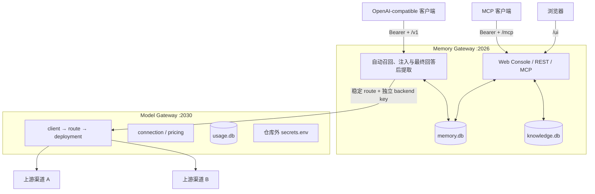

# Memory Platform

中文 · [English](README.en.md)

[](https://github.com/SparkHello/Memory_Platform/actions/workflows/ci.yml)
[](https://github.com/SparkHello/Memory_Platform/actions/workflows/docker.yml)
[](https://github.com/SparkHello/Memory_Platform/releases)
[](LICENSE)

本地优先、可审计、可治理的 AI 长期记忆平台，兼容 MCP 与 OpenAI Chat Completions。

Memory Platform 将原先独立的 `My_Memory` 和 `Model_Gateway` 合并到一个单仓库中，统一版本、测试、安装和迁移体验，同时继续保持两套服务在运行时的配置、密钥、数据和安全职责隔离。

它不是单纯的“向量库 + Prompt 拼接”：Memory Gateway 负责长期记忆与知识治理，Model Gateway 负责模型渠道、用途路由、故障切换、归因和费用。两者通过稳定 route 和独立本地 client key 通信。

## 为什么拆成两个网关

一个模型可能由不同渠道提供、使用不同账号付费，也可能承担聊天、记忆提取、知识检索或 embedding 等不同用途。把这些供应商细节直接写进记忆服务，会让密钥、价格、故障切换和记忆逻辑互相耦合。

Memory Platform 因此保留两个明确边界：

| 服务 | 默认地址 | 负责 | 不负责 |
| --- | --- | --- | --- |
| [Memory Gateway](services/memory-gateway/README.md) | `127.0.0.1:2026` | 长期记忆、近期上下文、独立知识库、MCP、OpenAI-compatible 记忆代理、Web Console | 管理供应商账号和渠道价格 |
| [Model Gateway](services/model-gateway/README.md) | `127.0.0.1:2030` | connection、deployment、route、fallback、密钥引用、用量与价格快照 | 保存聊天、记忆或知识正文 |

源码和测试统一提交到本仓库；运行配置、API Key、SQLite 数据、日志和评测快照仍保存在仓库外或被 Git 忽略。合并仓库不等于合并敏感数据边界。

## 核心能力

### 长期记忆与治理

- 从用户明确表达的内容中提取长期有用信息，目标是“不乱记”，而不是“尽量多记”。
- 保存前校验逐字 `source_quote`、事实锚点、主语、关系、对象、否定一致性和敏感授权。
- 支持 episodic、semantic、procedural、emotional、reflective 五类记忆扇区。
- 支持 dynamic、resolved、archived、pinned 生命周期，以及衰减、激活、浮现和两阶段 digest。
- 支持主题、实体、记忆空间、轻量网络图、Temporal 版本链、核心记忆和召回解释。
- 提供编辑、合并、软删除、恢复、永久删除、导出、健康检查和评估闭环。

### OpenAI-compatible 自动记忆代理

- 暴露 `/v1/models` 和 `/v1/chat/completions`，可接入 FLIT 等 Chat Completions 客户端。
- 每轮聊天自动召回并注入安全记忆，在完整最终回答后异步提取新记忆。
- 支持 SSE 流式、工具调用、多模态 message part、`reasoning_content`、usage-only chunk 和未知扩展字段透明转发。
- 记忆模式支持 `off`、`read`、`read-write`，可按请求覆盖。
- 编辑旧消息或重新生成回答时保留对话分支，避免不同分支的近期上下文串线。

### MCP 接入

- 通过 `/mcp` 提供 Streamable HTTP MCP。
- 适合让模型显式决定何时搜索、保存、浮现或整理记忆。
- 同时提供独立知识库的浏览、检索、精读、上传和文档管理工具。
- MCP 与 `/v1` 可以同时开启，但同一客户端通常只需选择一种主要记忆路径。

### 独立长文本知识库

- 支持文本、Markdown、PDF、DOCX 和 EPUB。
- 记忆库与知识库使用不同 SQLite 文件，避免长文档进入记忆衰减、浮现和自动聊天上下文。
- 支持不可变文档版本、FTS5、chunk embedding、混合检索和精确片段引用。
- 知识代理只编排本地索引并选择引用，最终正文来自本地存储，不执行文档中的指令。

### 模型连接、路由与费用

- 将 client、connection、deployment、route 和 pricing 分层管理。
- route 使用稳定业务名称，具体渠道或模型变化时，Memory Gateway 无需改代码。
- 支持按用途配置有序 fallback；流式响应只允许在首字节前切换，开始输出后不会拼接另一家结果。
- 成功响应包含实际 route、deployment、connection、渠道、模型作者和上游模型归因。
- embedding route 强制使用一致的 `embedding_space` 和维度，防止不同向量空间被错误比较。
- 用量库只记录身份、路由、状态、Token、耗时和价格快照，不记录 Prompt、回复、工具参数、embedding 输入或知识正文。

### Web Console

Memory Gateway 在 `/ui/` 提供 React Web Console，用于：

- 查看、搜索、编辑和治理长期记忆；
- 查看核心记忆、近期上下文、时间线、网络图与召回解释；
- 导入、检索和管理知识文档；
- 运行健康检查、体检和召回评估；
- 查看模型连接状态、用途路由和用量概览；
- 导出、备份和恢复数据。

| 记忆工作室 | 记忆库 | 记忆档案 |
| --- | --- | --- |
| [](docs/images/console-studio.png) | [](docs/images/console-memories.png) | [](docs/images/console-memory-detail.png) |

## 架构与数据流



一次 `/v1/chat/completions` 请求大致经历：

1. Memory Gateway 从最后一条用户消息和可见历史识别当前分支。
2. 在超时预算内召回长期记忆；embedding 不可用时安全回退关键词检索。
3. 过滤 private/sensitive 内容，并在字符预算内把记忆插入初始 system 区域。
4. 使用 `memory.chat` route 调用 Model Gateway，由后者选择实际 deployment 和 connection。
5. 响应以原始 JSON 或 SSE 字节透明转发给客户端。
6. 只有收到完整最终文本、没有未完成工具调用且不是截断/内容过滤时，才进行幂等激活、分支保存和后台记忆提取。

## 选择接入方式

| 使用目标 | 推荐入口 | 记忆由谁触发 |
| --- | --- | --- |
| FLIT 等 Chat Completions 客户端，希望自动召回和保存 | `/v1` | Memory Gateway 自动处理 |
| 支持远程 MCP，希望模型主动管理记忆 | `/mcp` | 模型显式调用工具 |
| 查看、治理、备份、评估或手工修改 | `/ui` 或 REST | 用户或管理程序 |
| 只需要统一模型连接与路由 | Model Gateway `/v1` | 调用方选择 route |

知识库始终需要显式 MCP、REST 或 Web 操作，不会因为使用聊天代理而自动进入上下文。

## 快速开始

### 环境要求

- Python ≥ 3.12（`python3.12`、`python3.13` 或满足版本的 `python3` 均可）；CI 同时验证 3.12 和 3.13。
- Node.js 22 与 npm，用于构建 Web Console。
- 当前统一安装脚本面向 macOS/Linux；服务内部仍保留部分 Windows 辅助脚本。

### 一键安装双服务运行栈

在仓库根目录执行这一条命令：

```bash
scripts/setup.sh
```

在真实终端中，它会连续完成：准备 Python 环境、安装两个服务、构建 Web Console、生成本地身份并安全接线、启动双服务，然后直接进入一次问完的模型配置并运行最终检查。暂时不需要前端时用 `scripts/setup.sh --skip-ui`；只准备运行环境、暂不配置模型时用 `scripts/setup.sh --install-only`。

### 或者用 Docker（不需要 Python/Node）

已安装 Docker Desktop 时，可以不 clone 仓库、不装任何依赖，两条命令跑起来：

```bash
curl -O https://raw.githubusercontent.com/SparkHello/Memory_Platform/main/deploy/docker-compose.user.yml
docker compose -f docker-compose.user.yml up -d
```

首次启动会自动完成双服务接线，并在容器日志里**各打印一次** `GATEWAY_API_KEY` 和 Web 配置管理密钥（admin key）：

```bash
docker compose -f docker-compose.user.yml logs memory-platform
```

Web Console 在 `http://127.0.0.1:2026/ui/`。所有运行数据（配置、密钥、SQLite、日志）都在 `memory-platform-data` 卷里，升级镜像只需 `docker compose -f docker-compose.user.yml pull && up -d`，数据不受影响。日常管理仍可进容器使用 `memgw` / `modelgw`：`docker compose -f docker-compose.user.yml exec memory-platform memgw --help`。

`stack install` 会初始化仓库外配置，为两个服务创建彼此独立的本地身份，安全生成并同步 backend key，还会**自动生成客户端访问密钥（`GATEWAY_API_KEY`）并在输出中打印一次**——请妥善保存，它不会再次显示，也不会写入仓库 `.env`。这就是客户端访问 `/v1`、MCP、REST 和 Web Console 时使用的密钥，与 backend key、admin key 和供应商 API Key 都不同。需要更换时运行 `scripts/memgw secret set gateway`。

需要分步执行或了解各步细节，见 [Memory Gateway README](services/memory-gateway/README.md)；`bootstrap.sh` 与 `memgw stack install --start` 仍可单独调用。

### 第一次配置模型

直接运行上面的 `scripts/setup.sh` 时，模型 quickstart 已经包含在同一流程中。安装过环境后想单独重新配置，也可以运行：

```bash
services/memory-gateway/.venv/bin/modelgw quickstart
```

它只询问渠道、API Key，以及是否配置语义搜索；预设渠道会自动读取当前 key 可见的精确模型 ID 供选择。先让一个模型承担全部文字用途，最后自动连接并重启记忆服务。想用交互式主菜单精细配置，仍可运行 `scripts/memgw` 选择“设置模型渠道、模型和用途”。

不习惯命令行的用户也可以完全在浏览器里完成首次配置：`stack install`（含 `scripts/setup.sh` 和 Docker 首启）会自动生成并**打印一次** Model Gateway admin key；打开 `http://127.0.0.1:2026/ui/` 的「模型与路由」页，粘贴该 key 解锁后点「新建渠道」，按向导选预设、填渠道 key、从自动发现的列表选模型即可，无需任何 CLI 操作。admin key 丢失时用 `modelgw secret set memory-console-admin` 重新设置。

quickstart 内置 DeepSeek、Kimi 中国区、MiMo 和 DashScope 北京区地址预设；选择预设并隐藏输入 API Key 后，会只读请求一次 `/models`，让你按实际可用列表选择，不发送推理。自定义渠道仍可手工填写官方 Base URL。已有环境只想重新配置时使用 `scripts/setup.sh --configure-only --config <文件> --json`，不会重复安装依赖或运行 `stack install`。

想让 AI/Agent 帮你配置，可让它生成一份**不含密钥**、符合 [`ai-quickstart.schema.json`](docs/ai-quickstart.schema.json) 的配置单，再用 `scripts/setup.sh --config <文件> --json` 一条命令完成。API Key 只从标准输入传入，配置单会拒绝未知字段和密钥字段。完整流程见 [让 AI 帮你安装](docs/ai-install.md)。

Model Gateway 中的几个用户概念：

| 概念 | 含义 |
| --- | --- |
| 渠道 / connection | 实际购买 API、持有账号和密钥的服务商 |
| 模型 / deployment | 该渠道上的精确上游模型 ID 与能力声明 |
| 用途 / route | `memory.chat`、`knowledge.fast` 等稳定业务名称 |
| 优先顺序 | 当前 deployment 不可用时的 fallback 顺序 |
| 价格 | 与 deployment 绑定、经人工核对的官方价格快照 |

默认推荐的八条 route：

| Route | 用途 |
| --- | --- |
| `memory.chat` | `/v1` 透明聊天代理 |
| `memory.extract` | 长期记忆提取 |
| `memory.compact` | 较早对话上下文压缩 |
| `memory.core` | 核心记忆整理 |
| `memory.review` | 记忆体检与修改建议 |
| `knowledge.fast` | 知识检索快速阶段 |
| `knowledge.pro` | 复杂知识检索升级阶段 |
| `memory.embedding` | 记忆与知识 embedding |

Model Gateway 的终端菜单可以自动完成常见配置；需要精细控制时参阅 [Model Gateway README](services/model-gateway/README.md)。

### 检查运行状态

```bash
scripts/memgw stack status
scripts/memgw stack doctor
```

常用地址：

| 用途 | URL |
| --- | --- |
| Web Console | `http://127.0.0.1:2026/ui/` |
| Memory Gateway 健康检查 | `http://127.0.0.1:2026/health` |
| MCP | `http://127.0.0.1:2026/mcp` |
| OpenAI-compatible Memory base URL | `http://127.0.0.1:2026/v1` |
| Model Gateway base URL | `http://127.0.0.1:2030/v1` |

日常运行只需使用统一入口：

```bash
scripts/memgw stack start
scripts/memgw stack status
scripts/memgw stack doctor
scripts/memgw stack restart
scripts/memgw stack stop
```

装好后接入客户端时常踩的坑（手机上 `localhost`、key 只打印一次、模型名固定 `memory-auto` 等）集中列在 [客户端接入指南的速查表](docs/client-setup.md#常见坑速查表)。

## 客户端接入

已经在用 Chatbox、RikkaHub 等客户端、只需要知道「Base URL、API Key、模型名怎么填」的用户，直接看 [客户端接入指南](docs/client-setup.md)。下面是完整契约说明。

### OpenAI Chat Completions

客户端通常配置：

```text
Base URL: http://127.0.0.1:2026/v1
API Key:  安装时自动生成并打印的 GATEWAY_API_KEY（可用 memgw secret set gateway 更换）
Model:    memory-auto
```

手机上的 `localhost` 指向手机自身。手机或局域网客户端应使用运行 Memory Platform 的电脑局域网/Tailscale 地址，并确保 Memory Gateway 绑定允许访问的接口。不要把服务无鉴权暴露到公网。

`X-Memory-Mode` 可选择：

- `off`：只做透明代理；
- `read`：召回并注入记忆，但不提取新记忆；
- `read-write`：召回、注入，并在完整最终回答后提取新记忆。

完整的流式、工具调用、会话分支和客户端兼容说明见 [Memory Gateway README](services/memory-gateway/README.md#flit--openai-chat-completions-接入)。

### MCP

远程 Streamable HTTP MCP 地址为：

```text
http://127.0.0.1:2026/mcp
```

除健康检查外，MCP、REST、Web Console API 和 `/v1` 都使用 Memory Gateway 的 Bearer token。MCP 的具体工具及返回契约见 [MCP 工具说明](services/memory-gateway/README.md#mcp-工具)。

## 配置与安全边界

### 密钥和身份

系统中存在几类用途不同的密钥，不应复用：

| 密钥 | 用途 | 保存位置 |
| --- | --- | --- |
| Memory Gateway API key | 客户端访问 `/v1`、MCP、REST 和 Web Console API | Memory Gateway 用户配置目录 |
| Model Gateway backend key | Memory Gateway 调用允许的 `memory.*`、`knowledge.*` route | 两端各自的仓库外密钥文件 |
| Model Gateway admin key | 修改渠道密钥和 route 配置 | 仅管理端临时使用，不由 Memory Gateway 持久化 |
| Provider API key | 调用真实上游渠道 | Model Gateway 仓库外 `secrets.env` |

`GATEWAY_API_KEY` 默认绑定固定的 `GATEWAY_USER_ID`，调用方不能通过 `X-User-Id` 改写命名空间。`GATEWAY_ALLOW_USER_ID_HEADER=true` 仅用于旧版共享 key 迁移，不建议用于不可信网络。

### 敏感数据出站

- `ALLOW_SENSITIVE_EGRESS=false` 默认阻止本地识别为 private/sensitive 的内容进入远程记忆提取、embedding、AI 体检和知识代理。
- 该开关不拦截用户主动通过 `/v1` 发送给聊天上游的当前消息。
- `redact_sensitive=true` 只遮罩本次响应，不会改写 SQLite 原文，也不会让备份自动脱敏。
- 记忆与知识 embedding 必须携带可信且一致的空间 ID；缺失或不匹配时回退关键词/FTS，不猜测旧向量属于当前空间。

### 部署边界

当前默认目标是个人、本机或可信家庭网络：

- SQLite、缓存、工具幂等和部分后台状态按单进程设计；
- 不应把默认部署直接当成公开互联网多租户 SaaS；
- Model Gateway 管理接口默认只监听回环地址；跨主机暴露必须置于 HTTPS 后；
- 需要强隔离时，应为不同用户使用不同凭证和实例，而不是启用共享 key 的可变 `X-User-Id`。

完整安全说明见 [Memory Gateway 安全边界](services/memory-gateway/README.md#安全边界)和 [Model Gateway 核心边界](services/model-gateway/AGENTS.md#核心边界)。

## 数据、备份与迁移

### 数据在哪里

仓库只保存源代码和非敏感示例。实际运行数据位于用户配置目录，主要包括：

- 长期记忆、近期上下文和分支节点；
- 独立知识库和文档版本；
- Model Gateway 配置、用量库和价格快照；
- 两个服务各自的密钥文件和日志。

不要把 `.env`、真实 SQLite、日志、评测快照或便携备份提交到 Git。

### 便携备份

```bash
scripts/memgw stack backup --output memory-stack.zip
```

备份包含允许迁移的记忆库、知识库、Model Gateway 脱敏配置、用量库和非密钥设置，但不包含 provider key、admin key、backend key 或 Memory Gateway API key。

备份虽然不含密钥，仍包含完整私人记忆和知识正文，必须按敏感文件保管。

恢复到新设备：

```bash
git clone <your-repository-url> Memory_Platform
cd Memory_Platform
scripts/bootstrap.sh
scripts/memgw stack restore /path/to/memory-stack.zip --yes --start
```

恢复前会校验清单哈希、SQLite 和 JSON，停止两个服务，并为被替换的本机文件创建仓库外回滚副本。恢复后需要重新输入未进入备份的各类密钥。

### 从旧版 `My_Memory` + `Model_Gateway` 双目录迁移

如果旧设备仍保留两个独立项目，优先使用旧 `My_Memory` 中已经提供的统一栈备份，而不是手工复制 `.env` 或数据库：

```bash
cd /path/to/My_Memory
scripts/memgw stack backup --output /safe/path/memory-stack.zip

cd /path/to/Memory_Platform
scripts/bootstrap.sh
scripts/memgw stack restore /safe/path/memory-stack.zip --yes --start
```

迁移后：

- 旧 `My_Memory` 对应 `services/memory-gateway`；
- 旧 `Model_Gateway` 对应 `services/model-gateway`；
- 两个服务不再各自维护 Git 历史，统一从仓库根目录提交；
- 旧目录可以暂时保留作只读回滚来源，不要让新旧两套服务同时占用相同端口或写同一数据库；
- 确认新栈、Web Console、记忆数量和知识文档正常后，再自行决定是否归档旧目录。

## 兼容 direct-provider 模式

如果暂时不运行独立 Model Gateway，Memory Gateway 仍保留旧的 `UPSTREAM_*`、`LLM_*`、`memgw model`、`memgw route` 和 `memgw pricing` 兼容路径。

新部署推荐使用 Model Gateway。只要 `MODEL_GATEWAY_BASE_URL` 与 `MODEL_GATEWAY_API_KEY` 成对配置，聊天、后台记忆任务、知识代理和 embedding 就只调用稳定 route，不会在中央路由失败时偷偷回退到旧 `.env` provider key。

兼容模式的完整环境变量见 [Memory Gateway 配置项](services/memory-gateway/README.md#配置项)。

## 仓库结构

```text
Memory_Platform/
├── services/
│   ├── memory-gateway/       长期记忆、知识库、MCP、/v1 代理与 Web Console
│   │   ├── app/              FastAPI、记忆、知识、LLM、MCP、用量与 CLI
│   │   ├── ui/               React / TypeScript / Vite 控制台
│   │   ├── tests/            Memory Gateway 测试
│   │   └── docs/             接入、算法与产品文档
│   └── model-gateway/        模型连接、deployment、route、pricing 与 usage
│       ├── model_gateway/    服务、透明代理、路由、配置、管理接口与 CLI
│       ├── tests/            Model Gateway 测试
│       └── docs/             配置、协议、运行与 LiteLLM 评估
├── scripts/
│   ├── bootstrap.sh          创建统一开发环境并构建前端
│   ├── memgw                 双服务统一入口
│   └── test.sh               两个后端测试集和前端生产构建
├── deploy/                   Docker 入口脚本与用户/开发 compose 文件
├── Dockerfile                单容器双服务一体化镜像（含 UI 构建）
├── docs/reviews/             跨服务评测与审计报告
├── AGENTS.md                 仓库开发和安全边界
└── README.md
```

两个服务共享 Git 历史，但继续使用各自的运行配置、进程和数据库。不要在 `services/` 下再次执行 `git init`。

## 开发与验证

安装开发环境：

```bash
scripts/bootstrap.sh
```

运行完整门禁：

```bash
scripts/test.sh
```

该命令依次执行：

1. Memory Gateway pytest；
2. Model Gateway pytest；
3. Web Console TypeScript 检查和 Vite 生产构建。

定向测试示例：

```bash
cd services/memory-gateway
.venv/bin/python -m pytest tests/test_chat_gateway.py

cd ../model-gateway
../memory-gateway/.venv/bin/python -m pytest tests/test_service.py
```

仅修改前端时至少运行：

```bash
cd services/memory-gateway/ui
npm run build
```

测试必须使用 fake provider、`httpx.MockTransport` 和临时目录，不得调用真实供应商或修改真实 `memory.db`、`knowledge.db` 和用户配置目录。更详细的开发边界见根 [AGENTS.md](AGENTS.md) 及两个服务自己的 `AGENTS.md`。

## 当前范围

Memory Platform 当前适合：

- 个人 AI 助手和本地可信网络；
- 需要可审计、可编辑、可删除记忆的聊天客户端；
- 希望同时支持 OpenAI-compatible 与 MCP 的本地记忆基础设施；
- 对敏感内容出站、模型渠道归因和向量空间一致性有明确要求的知识工作台。

当前不以这些场景为目标：

- 未经额外加固的公网多租户 SaaS；
- 百万级记忆的低延迟 ANN 检索；
- 强一致、跨进程共享的任务队列和缓存；
- 完整实体消歧、双时态和深层多跳推理知识图谱；
- OpenAI Responses、音频、文件、图片生成等完整 API 代理。

架构、真实体验、横向对照和后续路线见 [Memory Platform 深度评测](docs/reviews/JJC-20260805-002-memory-platform-deep-review.md)。

## 进一步阅读

- [贡献指南](CONTRIBUTING.md)
- [安全策略](SECURITY.md)
- [变更记录](CHANGELOG.md)
- [客户端接入指南（Chatbox / RikkaHub 等）](docs/client-setup.md)
- [Memory Gateway 完整说明](services/memory-gateway/README.md)
- [Model Gateway 完整说明](services/model-gateway/README.md)
- [客户端接入](services/memory-gateway/docs/client_integration.md)
- [Model Gateway 配置标准](services/model-gateway/docs/configuration.md)
- [Model Gateway 客户端协议](services/model-gateway/docs/client-protocol.md)
- [运行、后台服务与健康检查](services/model-gateway/docs/operations.md)
- [Memory Platform 深度评测](docs/reviews/JJC-20260805-002-memory-platform-deep-review.md)

## 开源许可证

本项目采用 [Apache License 2.0](LICENSE)。该许可证包含显式的专利授权，同时要求保留版权声明并标注对文件的修改。

使用、修改或再分发本项目时，请保留 `LICENSE` 文件与版权声明。
