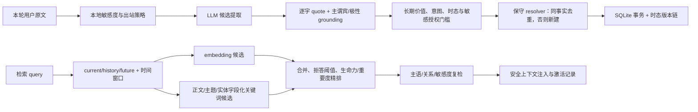

# memory-gateway 实现与记忆算法审查（2026-08-01）

## 结论

项目的总体分层是合理的：长期记忆、短期对话分支、核心记忆和长文本知识库彼此有清晰边界；记忆库与知识库物理隔离，REST/MCP/透明代理三条入口最终复用同一存储与安全规则。它原先最大的风险并不是“功能少”，而是若干启发式在边界输入下会把错误事实写得过于自信，或者让时态链、缓存与备份在少见操作后失去一致性。

本轮已优先修复会造成错误记忆、错误当前事实、跨时间误召、敏感信息泄露或不可逆数据不一致的问题。修复后，系统更接近“证据约束的个人记忆服务”，但不应宣称达到论文基准上的 SOTA：当前人工标注集仍很小，embedding 阈值与排序权重也尚未经过规模化校准。

## 当前数据流

## 主要发现与修复

| 范围 | 原风险 | 本轮处理 |
| --- | --- | --- |
| 候选 grounding | 共享实体即可让幻觉谓词通过；宠物/朋友的事实可能被降成用户事实；局部否定和并列句可能错配 | 逐命题校验对象、关系族、第一人称主语和局部极性；区分申请/任职、旅行住宿/常住、第三方/用户；Core 整理复用同一证据规则 |
| 敏感授权 | 英文 `remember when/whether/how` 等问句可能被误当作保存敏感原文的授权 | 授权改为子句级、内容绑定的显式记忆请求；无授权只允许严格最小化描述 |
| 时态提取与召回 | 普通查询可能召回已失效事实；点事件、未来事实和显式年份/相对日期处理不完整 | 新增统一 temporal 模块；默认 current，显式 history/future 使用有效区间和日历窗口；点事件保留在历史召回；缓存跨 `valid_from/valid_until` 边界提前失效 |
| 时态链写入 | PATCH、回收站恢复、部分覆盖导入可能产生双 current、单向引用或跨 key 链；并发 PATCH 可用陈旧快照覆盖 | 写操作改为 `BEGIN IMMEDIATE` 内读取和构造；移动节点会拆链/重建；恢复按时间重新接链；历史事实恢复为新版本而非改写旧行；不同时间版本禁止直接 merge |
| Resolver | 只看前 200 条可能漏掉重复；A→B→A 会被旧 A 吞掉；向量相似可能把补充/冲突静默忽略 | 读取完整有效候选；只允许 live、同类型、同敏感度、同时间 key 的事实抑制；语义覆盖增加实体、主题、结构值、状态与关系约束，关系不一致时宁可新建 |
| 关键词召回 | 只搜索正文，`宠物→猫`、`电脑→笔记本`、主题标签等无法工作；宽泛词又容易把宠物饮食答成用户饮食 | 正文/主题/实体分字段打分，查询内 IDF 降低泛标签影响；加入小型可审计类别层级；增加用户/第三方和饮食偏好/拍照设备关系门控 |
| 排序与衰减 | 非法/非有限 lambda 可导致异常；缓存命中后生命力分数可能陈旧 | 模型、写路径与运行时三层校验 lambda；缓存只保存有限候选元数据，命中后从 SQLite 读活记录并重算衰减/排序 |
| 图算法 | 相似边预算可能先截掉种子可达边；网络只暴露相似度，evidence/temporal 关系不可见；不同 embedding 维度可能报错 | 保留显式 evidence/temporal 边并优先种子可达预算；Personalized PageRank 保留路径解释；维度不一致安全跳过 |
| 图健康度 | “有标签”曾被等同于“图已激活” | 诊断改为统计实际连接边、连接节点占比和边类型；共享大标签用生成树计数，避免 O(n²) 物化 |
| 导出/恢复 | 多次独立读可能导出混合时刻快照；部分恢复会误删仍有效引用或留下单向时态引用 | 单一 SQLite 读事务生成完整快照；导入映射后只裁剪真正不存在的引用；overwrite 后重建涉及的时间 key |
| 永久删除 | 只清 agent-derived 会漏掉保留 `user_asserted` origin 的合并依赖；闭包计算低效 | 按 evidence 反向邻接做 O(V+E) 闭包，清所有依赖、核心证据/历史和审计副本；提交后 eval 文件清理失败返回成功 + warning |
| 并发与迁移 | 多进程首次打开旧库时 WAL/迁移可能互锁 | memory/knowledge/usage 共用 locked/busy 有限退避，迁移使用即时写事务，并增加跨平台 spawn 回归 |
| 评测 | `precision_at_k` 实际除以返回条数；重复 query 会暗中重复加权；图/时态健康结论可能被回收站字段伪造 | P@k 改为固定 k 分母，同时保留 returned precision；完全重复 query 折叠、冲突标注拒绝；时态诊断区分活跃有效边、回收站边和 dangling 引用 |

## 算法评价

### 1. 写入策略

优点是门槛清晰，而且保存失败不会拖垮聊天主路径。`source_quote` 的逐字校验、敏感授权、长期价值门槛和保守 resolver 共同体现了“不乱记”的项目目标。

本轮后，grounding 已从“候选与 quote 有共同词”提升到“候选命题的主语、关系、对象和极性都有局部证据”。这是写入链最重要的修复，因为错误事实一旦持久化，会在后续召回、核心整理和图遍历中被反复放大。

仍需注意：自然语言蕴含不是有限规则可以完全解决的。当前策略有意偏向 precision——不确定时忽略或新建，而不是覆盖旧事实。对长期个人记忆，这是合适的失误方向。

### 2. 召回与排序

召回目前是 embedding 与关键词两个候选通道的并集。embedding 使用余弦拒绝阈值；本地关键词回退使用中文 n-gram、正文/主题/实体字段权重、少量类别层级与关系门控。最终相关性主要由语义/关键词分数决定，重要度、生命力和新鲜度只用于精排，不会让“重要但无关”的事实凭空进入候选。

这是一个适合个人规模 SQLite 的方案，优点是可解释、无 embedding 时仍能工作、无答案查询可以真正返回空。缺点是阈值与权重仍是人工设定；当库增长到数万条以上，最多 10,000 条内存候选扫描会成为召回率和时延边界，应改为 SQLite FTS5/BM25 候选生成，向量部分再接 ANN 或分片索引。

### 3. 时态记忆

时态事实使用 `(temporal_subject, temporal_predicate)` 作为版本槽位，`valid_from/valid_until` 表示有效区间，`supersedes/superseded_by` 提供可审计链。这与 temporal KG 的方向一致，但当前并不是完整知识图谱：没有通用实体消歧、关系 schema 学习或双时态（事实有效时间 + 数据库事务时间）的查询语言。

修复后的关键性质是：普通问题只看到当前有效版本；历史/未来问题按意图和时间窗口筛选；写入、PATCH、回收站恢复和覆盖导入都在事务中重建双向链；恢复旧事实会产生新的 current 版本，旧历史保持不可变。

### 4. 衰减、激活与自然浮现

生命力公式综合重要度、激活次数、扇区 lambda、时间衰减、情绪唤起、生命周期状态和 digested 因子。它适合作为“治理/浮现排序”，不应取代相关性候选生成。本轮保留了这一边界，并修复缓存命中后的重算和非法 lambda 防御。

公式借鉴遗忘曲线是合理启发式，但 lambda、短长期权重和状态因子尚没有通过用户行为数据拟合。现阶段应把分数理解为可解释的产品启发式，而不是认知科学意义上的记忆概率。

### 5. 图检索

网络同时包含显式 evidence、temporal、核心证据边和相似边；遍历使用有界 Personalized PageRank，并提供到种子的路径。这一实现适合“从一条记忆探索邻近主题”，但不应把共享通用空间/标签视为强语义推理。

真实库的活跃图目前主要由共享主题、实体和空间连接，显式 evidence/temporal 活跃边仍很少。因此图功能已被结构性激活，但多跳答案质量还需要更细的关系类型和标注评测。

## 与研究工作的关系

| 研究 | 对本项目的启示 | 当前落实程度 |
| --- | --- | --- |
| [LongMemEval](https://arxiv.org/abs/2410.10813) | 长期记忆不能只测相似检索，还要测信息提取、多会话推理、时间推理、知识更新与拒答 | 已覆盖 extraction/update/temporal/abstention 的本地微评测，跨会话推理仍缺规模化题集 |
| [Mem0](https://arxiv.org/abs/2504.19413) | 选择性抽取、更新与检索比无限追加上下文更有效 | 已采用候选抽取 + 保守 resolver + 核心记忆；本项目更强调本地敏感边界 |
| [Zep: A Temporal Knowledge Graph Architecture for Agent Memory](https://arxiv.org/abs/2501.13956) | 事实版本、失效区间和关系图能改善动态知识 | 已有轻量版本槽位与有效区间，但不是完整 temporal KG |
| [HippoRAG](https://openreview.net/pdf/413cf0c8eb9c809fcd65b71fac6d0531cceed40c.pdf) / [HippoRAG 2](https://openreview.net/pdf/ad8e7dbbc96bf16c53d3f6123935ca893398236f.pdf) | 图结构与 Personalized PageRank 可支持多跳联想式检索 | 已用于有界网络遍历；当前图关系质量和规模远小于论文设置 |
| [A-MEM](https://arxiv.org/abs/2502.12110) | 记忆可动态形成属性与链接，而不是固定槽位堆叠 | topics/entities/spaces 提供轻量动态组织，但没有让模型自由改写历史网络 |
| [MemoryBank](https://arxiv.org/abs/2305.10250) | 长期对话记忆可结合遗忘曲线与回忆强化 | 已实现扇区化衰减和激活强化；参数仍需行为数据校准 |
| [LoCoMo](https://arxiv.org/abs/2402.17753) | 长上下文记忆需要同时测单跳、多跳、时间与开放域问答 | 可作为下一阶段扩充本地标注集的题型参考 |

## 验证结果

### 自动化回归

- 全量测试：`737 passed in 16.33s`。
- `python -m compileall -q app`：通过。
- `git diff --check`：通过。
- 多进程旧库迁移、时态链、导出/恢复、敏感 grounding、缓存边界、图遍历和 no-answer 均有新增定向回归。

### 人工标注召回快照

现有 20 行标注中有 1 个完全重复 query，评测器现会折叠为 19 个唯一 query：14 个 relevant、5 个 no-answer，`k=8`，纯本地关键词模式、不更新真实激活次数。

| 指标 | 修复后 |
| --- | ---: |
| Hit@8 | 0.8571 |
| P@8（固定 8 为分母） | 0.2321 |
| 实际返回集 precision | 0.5553 |
| Recall@8 | 0.7548 |
| MRR | 0.6905 |
| nDCG@8 | 0.6846 |
| no-answer false-positive rate | 0.0 |
| no-answer abstention rate | 1.0 |

旧实现运行同一文件时 Hit@8 为 0.50、Recall@8 为 0.3976、MRR 为 0.4167、nDCG@8 为 0.3902；旧评测器把返回集 precision 错标成 P@k，并让重复 no-answer query 重复加权，因此不把旧 `precision_at_k` 数字当作可比基线。

仍未命中的两个 relevant query 是“兴趣”和“人生经历”。这两个问题范围很宽，当前选择拒答而不是把所有偏好/教育/项目事实一股脑注入；是否扩展应先补更完整的相关性标注。

### 真实库只读检查

- 物理记忆 58 条，活跃视图 46 条；embedding/topics/entities/evidence JSON、type、status、usage 和 temporal key 均无结构异常。
- 15/46 条活跃记忆曾被召回，累计 activation 19，Top-1 集中度 0.158。
- 活跃图有 172 条去重连接边、覆盖 46/46 个节点；当前主要来自 topic/entity/space，共享标签图已启用，但活跃 evidence/temporal 显式边仍为 0。
- 生命周期状态在活跃视图中仍全部为 dynamic，因此 resolved/pinned 的排序因子在真实数据上处于 dormant。
- 只读诊断发现旧程序遗留的 1 个 active→recycle-bin 时态引用。代码已在 `init_db` 中加入幂等 active-chain rebuild；本次审查没有启动写路径或修改 `data/memory.db`，它会在服务下次正常初始化时修复。

## 仍然存在的限制

1. 人工标注集规模小，且存在一个完全重复 query；本轮评测已自动折叠，但还需要补充同义问法、否定、第三方主语、时间范围和多跳问题。
2. 当前关键词层级只覆盖少数高频类别，不能代替通用语义模型；“兴趣”“人生经历”等极宽查询仍会选择拒答，以换取较低误召。
3. embedding 模型或维度变化后需要重嵌入；在相同模型的标注集上重新跑阈值扫描之前，不应仅凭感觉下调 `0.55` 拒绝阈值。
4. 召回仍是最多 10,000 条个人记忆的内存扫描；网络相似边在最多 1,000 个候选内计算。个人规模可接受，大规模需要 FTS/ANN 和增量图索引。
5. 时间意图目前依赖可审计的中英文规则与日历窗口，复杂持续区间、模糊时间和多时区表达仍需要更完整的 temporal parser。
6. FLIT 工具推理回放、幂等状态和召回缓存是单进程短 TTL；多 worker 需要共享状态或明确禁用这些优化。
7. 真实库当前有 1 个旧版本产生的回收站时态引用；只读诊断会继续如实显示，服务下次正常初始化时会由幂等链重建修复。若需要在启动前预览变化，仍应增加独立 dry-run 工具。

## 建议的下一阶段

1. 把标注集扩到至少 100–200 个去重 query，按 direct、paraphrase、temporal、update、multi-hop、no-answer、third-party 分层报告。
2. 在隔离快照上做 embedding 阈值与排序权重网格搜索，固定训练/验证切分，避免围绕 20 条样本过拟合。
3. 用 SQLite FTS5/BM25 做字段化候选生成；topics/entities/space 使用独立列权重，embedding 只重排 Top-N。
4. 为时态链提供显式 dry-run repair 工具，列出将重连的版本与边界，用户确认后才写真实库。
5. 为图遍历建立多跳相关性标注，分别报告显式 evidence/temporal 边与共享标签边的贡献。
